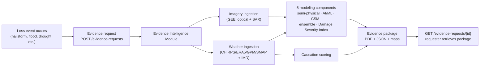

# Evidence Intelligence Module

Turns satellite and weather observations into reproducible, spatially explicit, auditable technical evidence for crop-damage and yield-loss claims under India's PMFBY/RWBCIS crop insurance schemes — closing the *evidence gap* that causes many legitimate claims to fail, without touching Crop Cutting Experiments, without running predictive alerting, and without depending on any specific claim-intimation channel.

Full orientation — goal, problem, boundaries — lives in [`documents/README.md`](documents/README.md). This file covers the project flow and how to run it.

## Project Flow

A request carries only a field geometry, an event date, a peril type, and an optional opaque reference ID — the same generic contract for every caller (voice-agent, web portal, CSC workflow, or an insurer's own system). The module ingests satellite imagery and weather data for that specific field and date, runs the five modeling components independently, scores how well the reported weather event aligns with the observed damage, and assembles everything into a package with mandatory source attribution, methodology version, accuracy statement, and chain of custody (Indian Evidence Act §65B). If satellite imagery isn't available yet, a weather-only preliminary package is delivered instead of a failure, and the request stays open until a complete package can be generated.

Full step-by-step detail: [`documents/Evidence-Flow-Spec.md`](documents/Evidence-Flow-Spec.md). API shape: [`specs/001-evidence-generation-pipeline/contracts/evidence-request-api.md`](specs/001-evidence-generation-pipeline/contracts/evidence-request-api.md).

## Repository Layout

| Path | What it is |
|---|---|
| [`documents/`](documents/) | The domain documentation — goal, non-negotiables, architecture, modeling science, pipeline detail. Start here to understand *why*. |
| [`specs/001-evidence-generation-pipeline/`](specs/001-evidence-generation-pipeline/) | The Spec Kit plan translating the architecture into a buildable spec/plan/task list. |
| [`src/`](src/) | The implementation — a Python/FastAPI service. Start here to understand *how it runs*. |
| [`CLAUDE.md`](CLAUDE.md) | Full directory map and hard boundaries, for anyone (human or AI) working in this repo. |
| [`SETUP.md`](SETUP.md) | Machine/tooling setup for a fresh clone. |
| [`GUIDE.md`](GUIDE.md) | Configuration, running the service, training the AI/ML model, and current open issues. |

## How to Use It

See [`GUIDE.md`](GUIDE.md) for configuration, running the service, training the AI/ML model, and open issues.

## Current Status

All 42 implementation tasks in [`tasks.md`](specs/001-evidence-generation-pipeline/tasks.md) are complete and tested (55/55 passing).

- **Postgres+PostGIS: verified working**, not just documented. `docker compose up -d` in `src/` was run for real; the PostGIS extension was enabled, `Base.metadata.create_all()` created all 5 tables exactly matching `data-model.md`, and a full round-trip through the real `EvidenceStore` (create request → add satellite result → update status → fetch back) succeeded against the live database — not the test fake.
- **Google Earth Engine: still not exercised** — no service account credentials are available in this environment, so `gee_client.py` has never made a real API call. This is the one genuine infrastructure gap left; `docker`/Postgres is no longer one.
- The AI/ML damage model ships **untrained** by default — see [`GUIDE.md`](GUIDE.md#training-the-aiml-model) for how to change that once labeled data exists.

Three things remain deliberately open (not blocking, all documented rather than guessed at): the CSM "high-scrutiny" trigger, the causation low-confidence numeric threshold, and the AI/ML training-data source (including whether historical CCE outcomes may be used as offline training labels) — see [`GUIDE.md`](GUIDE.md#open-issues) or the source files at [`specs/001-evidence-generation-pipeline/issue/`](specs/001-evidence-generation-pipeline/issue/).
