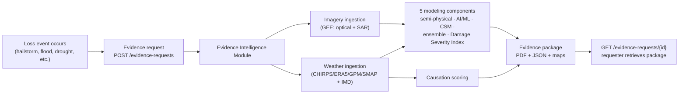

# ACIX — Evidence Intelligence Module

Turns satellite and weather observations into reproducible, spatially explicit, auditable technical evidence for crop-damage and yield-loss claims under India's PMFBY/RWBCIS crop insurance schemes — closing the *evidence gap* that causes many legitimate claims to fail, without touching Crop Cutting Experiments, without running predictive alerting, and without depending on any specific claim-intimation channel.

Full orientation — goal, problem, boundaries — lives in [`documents/README.md`](documents/README.md). This file covers the project flow and how to run it.

## Project Flow



A request carries only a field geometry, an event date, a peril type, and an optional opaque reference ID — the same generic contract for every caller (voice-agent, web portal, CSC workflow, or an insurer's own system). The module ingests satellite imagery and weather data for that specific field and date, runs the five modeling components independently, scores how well the reported weather event aligns with the observed damage, and assembles everything into a package with mandatory source attribution, methodology version, accuracy statement, and chain of custody (Indian Evidence Act §65B). If satellite imagery isn't available yet, a weather-only preliminary package is delivered instead of a failure, and the request stays open until a complete package can be generated.

Full step-by-step detail: [`documents/initiatives/evidence-intelligence-module/Evidence-Flow-Spec.md`](documents/initiatives/evidence-intelligence-module/Evidence-Flow-Spec.md). API shape: [`specs/001-evidence-generation-pipeline/contracts/evidence-request-api.md`](specs/001-evidence-generation-pipeline/contracts/evidence-request-api.md).

## Repository Layout

| Path | What it is |
|---|---|
| [`documents/`](documents/) | The domain documentation — goal, non-negotiables, architecture, modeling science, pipeline detail. Start here to understand *why*. |
| [`specs/001-evidence-generation-pipeline/`](specs/001-evidence-generation-pipeline/) | The Spec Kit plan translating the architecture into a buildable spec/plan/task list. |
| [`src/`](src/) | The implementation — a Python/FastAPI service. Start here to understand *how it runs*. |
| [`CLAUDE.md`](CLAUDE.md) | Full directory map and hard boundaries, for anyone (human or AI) working in this repo. |
| [`SETUP.md`](SETUP.md) | Machine/tooling setup for a fresh clone. |

## How to Use It

### 1. Set up the environment

```bash
cd src
uv venv .venv
uv pip install -e ".[dev]" --python .venv
```

### 2. Configure

The service needs three things to run for real — none are provisioned in this repo:

| Variable | What it's for |
|---|---|
| `GEE_SERVICE_ACCOUNT_CREDENTIALS` | Path to a Google Earth Engine service account key — satellite/weather ingestion |
| `DATABASE_URL` | A PostgreSQL+PostGIS connection string — `docker-compose up -d` in `src/` starts one locally |
| `EVIDENCE_STORE_BUCKET` | Object storage bucket name for generated packages (falls back to local disk in dev — see `LocalObjectStorage`) |

Without these, the service still runs and its test suite still passes (tests inject fakes for GEE/weather/storage), but real evidence requests will fail at the ingestion step.

### 3. Run the tests

```bash
.venv/Scripts/python -m pytest tests/
```

46 tests (unit/contract/integration) — all pass without any of the above configured.

### 4. Run the service

```bash
.venv/Scripts/python -m uvicorn evidence_intelligence.api:app --reload
```

### 5. Submit an evidence request

```bash
curl -X POST http://localhost:8000/evidence-requests \
  -H "Content-Type: application/json" \
  -d '{
    "geometry": {"type": "Polygon", "coordinates": [[[77.0,20.0],[77.01,20.0],[77.01,20.01],[77.0,20.01],[77.0,20.0]]]},
    "event_date": "2026-08-08",
    "peril_type": "hailstorm",
    "external_reference_id": "your-own-correlation-key"
  }'
# -> {"request_id": "EIM-...", "status": "IN_PROGRESS", "estimated_completion": "..."}

curl http://localhost:8000/evidence-requests/EIM-...
# -> {"request_id": "EIM-...", "status": "COMPLETE", "package": {...}}
```

`peril_type` is one of `hailstorm`, `flood`, `drought`, `cyclone`, `unseasonal_rain`, `frost`, `heatwave`, `pest_disease_weather_induced`, `landslide`, `cloudburst`, `other`. Full request/response shapes, including the weather-only-preliminary and 404 cases: [`contracts/evidence-request-api.md`](specs/001-evidence-generation-pipeline/contracts/evidence-request-api.md).

## Current Status

All 42 implementation tasks in [`tasks.md`](specs/001-evidence-generation-pipeline/tasks.md) are complete and tested (46/46 passing). Two things are honestly incomplete rather than papered over:

- The AI/ML damage model ships **untrained** — no labeled data exists yet, so it uses a disclosed placeholder formula and reports `"untrained_placeholder"` rather than a fabricated accuracy figure.
- Nothing has run against real Earth Engine or a real Postgres instance in this environment — only against injected fakes. See `src/tests/fakes.py` for what's simulated.

Two spec-level decisions remain deliberately open (not blocking, both gated/configurable): the CSM "high-scrutiny" trigger and the causation low-confidence numeric threshold — see [`specs/001-evidence-generation-pipeline/issue/`](specs/001-evidence-generation-pipeline/issue/).
