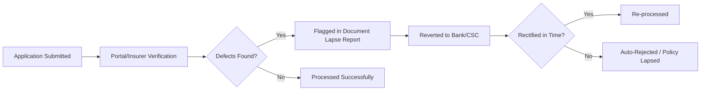
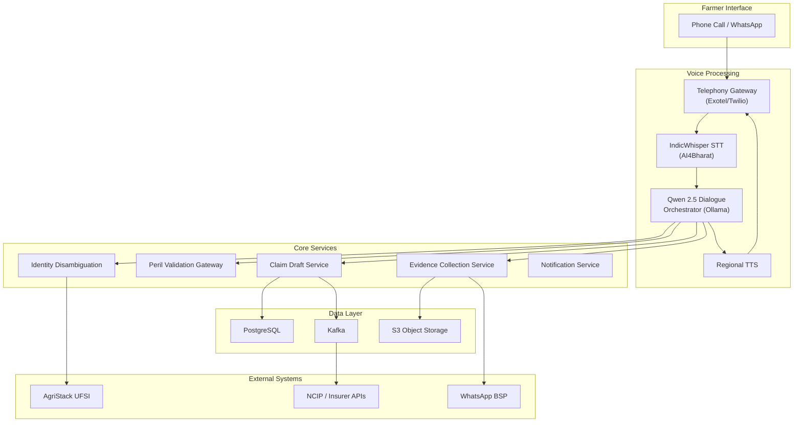
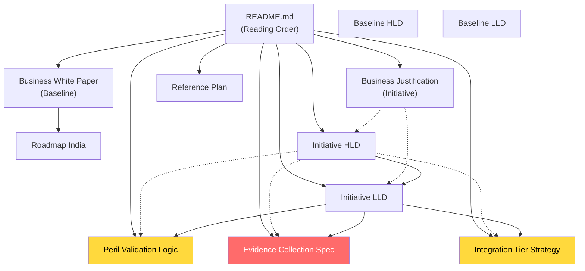
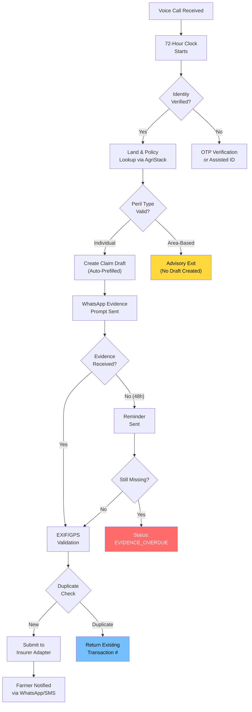
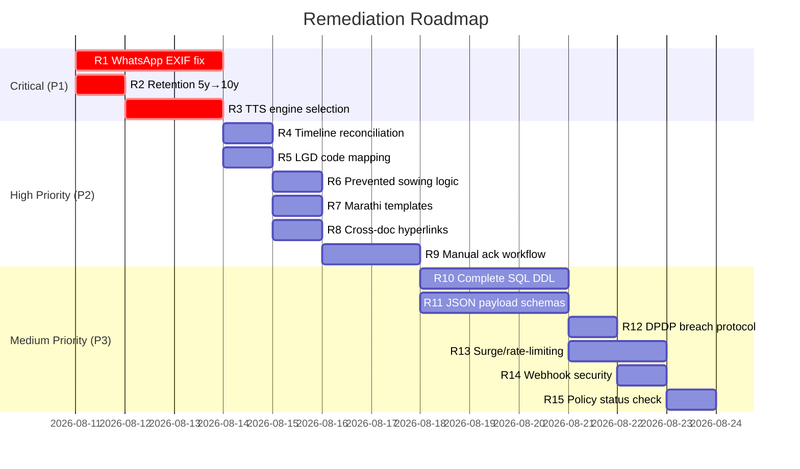

# Document Lapse Report: Voice-Assisted Crop Insurance Claim Intimation System

**White Paper — ACIX Platform**
**Date:** 10 August 2026
**Version:** 1.0
**Classification:** Internal — For Stakeholder Review

---

## Executive Summary

This white paper presents a comprehensive **Document Lapse Report** for the Voice-Assisted Crop Insurance Claim Intimation System being developed under the ACIX platform initiative. The system is designed to help Indian farmers submit crop loss intimations within the mandatory 72-hour window mandated by the **Pradhan Mantri Fasal Bima Yojana (PMFBY)** and the **Restructured Weather Based Crop Insurance Scheme (RWBCIS)**.

The report performs three critical analyses:

1. **Documentation Inventory & Cross-Reference Audit** — A complete inventory of all 15 design documents across 6 directories, assessing internal consistency, cross-referencing integrity, and coverage completeness.

2. **Gap Analysis: Implementation Plan vs. Documentation** — A point-by-point cross-check of the 7 critical gaps identified during the external business logic evaluation (shared via Gemini) against the current documentation suite, verifying whether each gap has been adequately addressed.

3. **Regulatory & Operational Document Lapse Risk Assessment** — An evaluation of how the system handles (or fails to handle) the endemic document lapse problems in India's crop insurance ecosystem, mapped against CAG audit findings, IRDAI guidelines, and PMFBY operational requirements.

### Key Findings

| Category | Status | Critical Issues |
|---|---|---|
| Documentation Coverage | ✅ Good | 15 documents cover architecture, business, and operations |
| 7-Gap Remediation | ⚠️ Mostly Addressed | 5 of 7 gaps fully resolved; 2 have residual issues |
| Cross-Document Consistency | ⚠️ Needs Attention | Timeline conflicts, missing hyperlinks, TTS unspecified |
| Critical Technical Flaw | 🔴 **Unresolved** | WhatsApp EXIF metadata stripping not addressed |
| Regulatory Compliance | ⚠️ Partial | Aadhaar Vault and DPDP addressed; LGD mapping and 10-year retention gaps |
| CAG Audit Preparedness | ⚠️ Partial | Over-insurance and duplicate prevention addressed; bank upload lapse monitoring absent |

---

## 1. Introduction

### 1.1 What is a Document Lapse in Crop Insurance?

In the context of Indian crop insurance, a **Document Lapse** refers to any failure, deficiency, or non-compliance in the documentation required for policy enrollment, claim intimation, or claim settlement. The **National Crop Insurance Portal (NCIP)** generates **Document Lapse Reports** (also known as "Reverted Application Reports") to track insurance applications that are incomplete, unverified, or deficient.

The document lapse lifecycle follows this pattern:



### 1.2 The 72-Hour Criticality

Under PMFBY operational guidelines, farmers experiencing localized crop calamities (hailstorm, landslide, inundation, cloudburst, natural fire) or post-harvest losses (unseasonal rain, cyclone during field-drying) must lodge individual claim intimations within **72 hours** of the event occurrence. Missing this deadline results in automatic claim rejection — one of the most common document lapses in Indian crop insurance.

> [!CAUTION]
> The 72-hour window is the single most impactful document lapse risk for individual farmers. The voice-assisted system's primary value proposition is reducing this lapse by enabling instant Day-1 intimation via a phone call.

### 1.3 Scope of This Report

This report covers:
- Complete documentation suite audit (15 files across 6 directories)
- Cross-verification of the 7-gap implementation replan
- 5 critical cross-document technical gaps
- Regulatory compliance mapping (PMFBY, IRDAI, DPDP Act 2023, Aadhaar Act 2016)
- CAG audit findings risk mapping
- Remediation recommendations with priority ranking

---

## 2. System Overview

The Voice-Assisted Crop Insurance Claim Intimation System is an AI-powered facilitation layer that enables farmers to lodge crop loss intimations via voice calls and WhatsApp. The system architecture comprises:



### Key Technology Choices

| Component | Technology | Rationale |
|---|---|---|
| Speech-to-Text | IndicWhisper (AI4Bharat fine-tuned) | Domain-specific ASR for Hindi, Marathi crop insurance vocabulary |
| LLM | Qwen 2.5 via Ollama | Self-hosted, privacy-preserving, tool-calling capable |
| Telephony | Exotel / Twilio | India-specific SIP trunking, TRAI DLT compliance |
| Evidence Channel | WhatsApp Business API (Gupshup/Twilio BSP) | 400M+ Indian users, geo-tagged media support |
| Data Store | PostgreSQL + S3 | Relational integrity for claims, object storage for media |
| Event Broker | Kafka | Event-driven processing for high-volume claim spikes |
| Identity Verification | AgriStack UFSI | Government farmer registry, land parcel verification |
| Integration | 4-Tier Model (Level 0–3) | Graceful degradation from manual CSV to real-time API |

---

## 3. Documentation Suite Inventory

### 3.1 Complete Document Tree

```
d:\Barrel\task\ACIX\crop-insurance\documents\
├── README.md                                          [Navigation Guide]
├── baseline/
│   ├── Business-White-Paper.md                        [10,535 bytes]
│   ├── HLD.md                                         [10,434 bytes]
│   ├── LLD.md                                         [17,854 bytes]
│   └── Roadmap-Region_India.md                        [13,672 bytes]
├── initiatives/
│   └── voice-agent-claim-intimation/
│       ├── current-design/
│       │   ├── Business-Justification.md              [8,612 bytes]
│       │   ├── Evidence-Collection-Spec.md            [6,928 bytes]
│       │   ├── HLD.md                                 [11,112 bytes]
│       │   ├── Integration-Tier-Strategy.md           [10,752 bytes]
│       │   ├── LLD.md                                 [14,931 bytes]
│       │   └── Peril-Validation-Logic.md              [9,893 bytes]
│       └── reference-plan/
│           ├── README.md                              [818 bytes]
│           └── Voice-Agent-Claim-Intimation-Plan.md   [16,889 bytes]
├── notes/
│   ├── Original-Exclusion-Notes.md                    [109 bytes]
│   └── Original-Inclusion-Notes.md                    [939 bytes]
└── documentation/
    └── Document-Lapse-Report-White-Paper.md           [This document]
```

**Total:** 15 source documents + 1 report document across 7 directories.

### 3.2 Document Inventory Matrix

| # | Document | Layer | Purpose | Last Updated | Status |
|---|---|---|---|---|---|
| 1 | README.md | Root | Navigation guide, reading order, scope boundary | Aug 2026 | ✅ Current |
| 2 | Business-White-Paper.md | Baseline | Executive business case for unified platform | Aug 2026 | ⚠️ Pre-voice-agent |
| 3 | baseline/HLD.md | Baseline | Broader platform architecture | Aug 2026 | ⚠️ Pre-voice-agent |
| 4 | baseline/LLD.md | Baseline | Platform SQL DDL, REST APIs, backlog | Aug 2026 | ⚠️ Pre-voice-agent |
| 5 | Roadmap-Region_India.md | Baseline | Market landscape, stakeholder mapping | Aug 2026 | ✅ Current |
| 6 | Business-Justification.md | Initiative | Voice agent business case, MVP scope | Aug 2026 | ✅ Updated |
| 7 | initiative/HLD.md | Initiative | Voice agent architecture, 16-step flow | Aug 2026 | ✅ Updated |
| 8 | initiative/LLD.md | Initiative | Voice agent data model, tools, tests | Aug 2026 | ✅ Updated |
| 9 | Evidence-Collection-Spec.md | Initiative | WhatsApp evidence capture pipeline | Aug 2026 | 🔴 Critical flaw |
| 10 | Peril-Validation-Logic.md | Initiative | 13 peril types, classification algorithm | Aug 2026 | ⚠️ Incomplete |
| 11 | Integration-Tier-Strategy.md | Initiative | Level 0–3 adapters, NCIP, AgriStack | Aug 2026 | ⚠️ Partial |
| 12 | Voice-Agent-Claim-Intimation-Plan.md | Reference | Earlier design, voice stack evaluation | Aug 2026 | ✅ Archive |
| 13 | reference-plan/README.md | Reference | Index file | Aug 2026 | ✅ Current |
| 14 | Original-Inclusion-Notes.md | Notes | Core requirements capture | Aug 2026 | ✅ Archive |
| 15 | Original-Exclusion-Notes.md | Notes | Scope exclusions | Aug 2026 | ✅ Archive |

---

## 4. Cross-Reference Analysis

### 4.1 Document Dependency Map



**Legend:** Solid lines = explicit references. Dashed lines = implicit/expected but missing references.

### 4.2 Cross-Reference Gap Findings

| Source Document | Expected Reference | Actual Status | Impact |
|---|---|---|---|
| Business-Justification.md | → initiative/HLD.md | ❌ **Missing** | No hyperlink to architecture details |
| Business-Justification.md | → initiative/LLD.md | ❌ **Missing** | No hyperlink to data model |
| initiative/HLD.md | → Evidence-Collection-Spec.md | ❌ **Missing** | Architecture diagram mentions Evidence Service but no link |
| initiative/HLD.md | → Peril-Validation-Logic.md | ❌ **Missing** | Peril gateway described but no link to logic spec |
| initiative/HLD.md | → Integration-Tier-Strategy.md | ❌ **Missing** | Level 0–3 described but no link to detail spec |
| initiative/LLD.md | → initiative/HLD.md | ❌ **Missing** | No back-reference to HLD |
| Peril-Validation-Logic.md | → initiative/LLD.md (peril_triage_log) | ✅ Implicit alignment | Table names match |
| Evidence-Collection-Spec.md | → initiative/LLD.md (claim_evidence) | ✅ Implicit alignment | Schema fields match |
| Integration-Tier-Strategy.md | → initiative/LLD.md (agristack_sync_log) | ✅ Implicit alignment | Table names match |
| Baseline HLD | → Initiative HLD | ❌ **Missing** | No forward reference to voice agent specialization |
| Baseline LLD | → Initiative LLD | ❌ **Missing** | No forward reference |

> [!WARNING]
> **11 missing cross-references** across the documentation suite. While document content is implicitly aligned (table names, service names, and architectural concepts match), the absence of explicit markdown hyperlinks means readers must manually cross-reference documents.

**Recommendation:** Add a `## Related Documents` section at the top of each initiative document with explicit file links.

---

## 5. Gap Analysis: Implementation Plan vs. Documentation

The implementation replan identified **7 critical gaps** from the external business logic evaluation. This section cross-checks each gap against the current documentation suite to assess remediation status.

### 5.1 Gap #1: Peril-Type Gating

| Attribute | Detail |
|---|---|
| **Gap Description** | System must validate whether a reported calamity requires individual intimation before processing |
| **Remediation Status** | ✅ **Fully Addressed** |

**Evidence of Resolution:**
- `Peril-Validation-Logic.md` — Dedicated 132-line specification with 13 peril types, classification matrix, fuzzy matching algorithm, and farmer advisory exit templates.
- `Business-Justification.md` §2.1 — New section on peril-type gating added.
- `initiative/HLD.md` §3 Step 9 — Peril validation gateway integrated into the 16-step call journey.
- `initiative/LLD.md` — `peril_triage_log` table, `validate_peril` MCP tool, `peril-triage.completed` Kafka topic all specified.

**Residual Issues:**
- ⚠️ **Prevented/Failed Sowing** — Listed as a conditional peril in the classification matrix but no specific decision algorithm or intake questions are defined. This peril type has unique requirements (sowing window verification, re-sowing thresholds) that differ from calamity-based perils.
- ⚠️ **Second Regional Language Templates** — Farmer advisory exit templates are provided only in Hindi and English. The MVP scope specifies "Hindi + 1 pilot state language" (likely Marathi), but Marathi templates are absent.

### 5.2 Gap #2: Mandatory Visual Evidence Collection

| Attribute | Detail |
|---|---|
| **Gap Description** | Voice-only flow is insufficient; geo-tagged photo/video evidence must be collected |
| **Remediation Status** | 🔴 **Partially Addressed — Critical Technical Flaw Remains** |

**Evidence of Resolution:**
- `Evidence-Collection-Spec.md` — Dedicated 99-line specification covering WhatsApp-triggered evidence prompts, EXIF metadata extraction, GPS-to-land matching, 72-hour timestamp compliance, image quality checks, and S3 storage/retention.
- `initiative/HLD.md` §3 Step 11 — Evidence prompt integrated into call journey.
- `initiative/LLD.md` — `claim_evidence` table with EXIF/GPS fields, `request_evidence` MCP tool, `evidence.upload.received` and `evidence.validation.completed` Kafka topics.

> [!CAUTION]
> **CRITICAL TECHNICAL FLAW: WhatsApp EXIF Metadata Stripping**
>
> The Evidence-Collection-Spec.md relies entirely on EXIF GPS coordinates and timestamps extracted from photos received via WhatsApp. However, **WhatsApp automatically strips EXIF metadata** (including GPS location and capture timestamp) from all images transmitted through its standard photo sharing pipeline. This is a privacy feature built into WhatsApp.
>
> EXIF data is preserved **only** when media is sent as a "Document" attachment rather than a photo. The specification makes **no mention** of this limitation and does not instruct the system or the farmer to use Document mode.
>
> **Impact:** The entire GPS-to-land-parcel matching pipeline and 72-hour timestamp verification pipeline will receive null/empty EXIF fields for all standard WhatsApp photo submissions, rendering the validation framework non-functional.

**Required Fix:**
1. Instruct farmers (via WhatsApp template message) to send photos as **Document** attachments
2. Request **WhatsApp Location** sharing as a supplementary GPS source
3. Provide a **web upload link** (via SMS) as a fallback channel that preserves EXIF
4. Add a validation rule: if EXIF GPS is absent, prompt the farmer to re-submit as Document or share location

### 5.3 Gap #3: NCIP/Insurer API Integration Strategy

| Attribute | Detail |
|---|---|
| **Gap Description** | Third-party APIs are rarely public; formal multi-tier integration model needed |
| **Remediation Status** | ✅ **Fully Addressed** |

**Evidence of Resolution:**
- `Integration-Tier-Strategy.md` — Dedicated 162-line specification with 4-tier model (Level 0–3), NCIP integration pathway, insurer-specific adapter strategies (AIC, SBI General), resilience retry matrix, and monitoring metrics.
- `initiative/HLD.md` §9 — Level 0–3 adapters explicitly shown in architecture diagram.
- `initiative/LLD.md` §9 — Adapter interface contracts defined.
- `baseline/HLD.md` — Level 0–3 model also defined in the broader platform architecture.

**Residual Issues:**
- ⚠️ **LGD Code Mapping** — Integration-Tier-Strategy.md notes that NCIP mandates Local Government Directory (LGD) code mapping for all geographic identifiers, but no schema field or mapping table is defined in either LLD.
- ⚠️ **Manual Acknowledgement Workflow** — For Level 0/1 manual handoffs, no UI/API endpoint is specified for operations staff to enter external acknowledgement numbers back into the system.

### 5.4 Gap #4: Phone-Number-to-Farmer Resolution

| Attribute | Detail |
|---|---|
| **Gap Description** | Rural households share phones; system needs explicit identity disambiguation |
| **Remediation Status** | ✅ **Fully Addressed** |

**Evidence of Resolution:**
- `Business-Justification.md` §5.1 — Phone-to-Farmer Disambiguation documented.
- `initiative/HLD.md` §3 Step 3 — Multi-FIN disambiguation integrated into call journey.
- `initiative/HLD.md` §4 — Identity Disambiguation Service defined as a core microservice.
- `initiative/LLD.md` — `farmer_contacts.linked_fin_ids` array field, `disambiguate_caller` MCP tool defined.

### 5.5 Gap #5: Seasonal Policy Multiplicity

| Attribute | Detail |
|---|---|
| **Gap Description** | Farmer may have overlapping policies on the same plot across Kharif/Rabi seasons |
| **Remediation Status** | ✅ **Fully Addressed** |

**Evidence of Resolution:**
- `Business-Justification.md` §5.2 — Seasonal Policy Resolution documented.
- `initiative/HLD.md` §3 Step 6 — Season-specific options presented to farmer in voice prompts.
- `initiative/LLD.md` — `policies.season_year`, `land_policy_links.season_year` fields added; lookup chain defined (Phone → FIN → Land → Active Policies by Season).

### 5.6 Gap #6: AgriStack Integration

| Attribute | Detail |
|---|---|
| **Gap Description** | UFSI APIs available for farmer identity and land verification |
| **Remediation Status** | ✅ **Fully Addressed** |

**Evidence of Resolution:**
- `Integration-Tier-Strategy.md` §5 — Dedicated section on AgriStack UFSI integration covering Farmer Registry, Land Verification, and Crop Sown Registry APIs with 24-hour local caching and fallback strategy.
- `initiative/HLD.md` §2 — AgriStack UFSI shown as external dependency in architecture diagram.
- `initiative/LLD.md` — `agristack_sync_log` table defined.

### 5.7 Gap #7: IndicWhisper over Vanilla Whisper

| Attribute | Detail |
|---|---|
| **Gap Description** | Domain-specific fine-tuned ASR needed for crop insurance terminology |
| **Remediation Status** | ✅ **Fully Addressed** |

**Evidence of Resolution:**
- `Business-Justification.md` §6 — IndicWhisper specified as primary ASR engine.
- `initiative/HLD.md` §8 — Domain prompt-tuning and IndicNLP normalization layer documented.
- `initiative/LLD.md` §4 — Step 2 specifies IndicWhisper with domain prompt-tuning and confidence thresholds.
- `Peril-Validation-Logic.md` §6 — Fuzzy vocabulary dictionary supports IndicWhisper's regional language processing.

### 5.8 Gap Remediation Summary

| # | Gap | Status | Confidence | Residual Issues |
|---|---|---|---|---|
| 1 | Peril-type gating | ✅ Addressed | 85% | Prevented sowing logic missing; Marathi templates absent |
| 2 | Visual evidence collection | 🔴 Critical flaw | 60% | WhatsApp EXIF stripping not addressed |
| 3 | NCIP/Insurer API integration | ✅ Addressed | 90% | LGD mapping and manual ack workflow gaps |
| 4 | Phone-to-farmer resolution | ✅ Addressed | 95% | No residual issues |
| 5 | Seasonal policy multiplicity | ✅ Addressed | 95% | No residual issues |
| 6 | AgriStack integration | ✅ Addressed | 90% | Dependent on DA&FW sandbox approval |
| 7 | IndicWhisper ASR | ✅ Addressed | 95% | No residual issues |

---

## 6. Critical Cross-Document Technical Gaps

Beyond the 7 gaps from the implementation replan, cross-document analysis revealed **5 additional systemic gaps** in the documentation suite:

### 6.1 GAP-T1: WhatsApp EXIF Metadata Stripping (CRITICAL)

> [!CAUTION]
> **Severity: CRITICAL — System-breaking**
> **Affected Documents:** Evidence-Collection-Spec.md, initiative/HLD.md, initiative/LLD.md

| Aspect | Detail |
|---|---|
| Issue | WhatsApp strips EXIF metadata (GPS, timestamp) from images unless sent as Document |
| Impact | GPS-to-land matching and 72-hour timestamp validation pipelines are non-functional |
| Root Cause | Specification authored without testing actual WhatsApp media handling behavior |
| Affected Components | Evidence validation worker, claim_evidence.exif_gps_lat/lon fields, evidence.validation.completed Kafka topic |

**Remediation Actions:**
1. Update Evidence-Collection-Spec.md §3 to instruct farmers to send photos as "Document" attachments
2. Add WhatsApp Location sharing as a supplementary GPS input
3. Add a web upload link fallback via SMS that preserves EXIF
4. Update WhatsApp template message to include explicit Document attachment instructions in Hindi/regional language
5. Add validation logic: if EXIF is null, check for separately shared WhatsApp Location

### 6.2 GAP-T2: Timeline Mismatch (14 Weeks vs. 12 Weeks)

> [!WARNING]
> **Severity: MEDIUM — Planning inconsistency**
> **Affected Documents:** initiative/LLD.md §12, initiative/HLD.md, Business-Justification.md, Business-White-Paper.md

| Document | Stated Timeline |
|---|---|
| initiative/LLD.md §12 (Build Order) | **14 weeks** (7 phases) |
| Business-Justification.md | References "12-week pilot" |
| Business-White-Paper.md | References "12-week" Phase 1 |
| initiative/HLD.md | Implicit 12-week alignment |

**Remediation:** The LLD's 14-week timeline is the accurate figure (accounting for the 2 additional weeks needed for Peril Validation and Evidence/Dedup phases added during the replan). Update Business-Justification.md and Business-White-Paper.md to reference the 14-week timeline, or reconcile by overlapping phases.

### 6.3 GAP-T3: Text-to-Speech (TTS) Engine Unspecified

> [!IMPORTANT]
> **Severity: HIGH — Architecture gap**
> **Affected Documents:** initiative/HLD.md, initiative/LLD.md

The architecture diagrams show "Regional-language TTS" as a component in the voice processing pipeline, and the system context diagram includes a TTS node. However, **no TTS provider, model, or integration framework is specified anywhere** in the documentation suite.

**Options to evaluate:**
- **AI4Bharat IndicTTS** — aligns with IndicWhisper choice
- **Google Cloud Text-to-Speech** — supports Hindi, Marathi, Tamil with neural voices
- **Azure Cognitive Services** — supports Indian languages
- **Bhashini ULCA TTS** — government initiative, India-hosted

### 6.4 GAP-T4: Incomplete Schema Definitions

> [!IMPORTANT]
> **Severity: HIGH — Implementation ambiguity**
> **Affected Documents:** initiative/LLD.md

The LLD specifies 14 tables using descriptive markdown tables with field names and descriptions, but lacks:
- Full SQL DDL with explicit data types (varchar length, integer size, timestamp precision)
- NULL/NOT NULL constraints
- Foreign key relationships and ON DELETE/UPDATE cascading rules
- Default values
- Check constraints (e.g., ENUM validation for status fields)

**Note:** The baseline/LLD.md contains complete SQL DDL for the broader platform. The initiative LLD should align to that standard.

### 6.5 GAP-T5: Missing JSON Payload Schemas

> [!IMPORTANT]
> **Severity: MEDIUM — Integration ambiguity**
> **Affected Documents:** initiative/LLD.md

The LLD specifies:
- 10 REST API endpoints (listed with paths but no request/response JSON schemas)
- 9 Kafka topics (listed with producer/consumer but no message payload schemas)
- 13 MCP tool contracts (listed with input/output descriptions but no formal JSON Schema)

**Remediation:** Add OpenAPI 3.0 schemas for REST endpoints and AsyncAPI schemas for Kafka topics, or add inline JSON examples for each.

---

## 7. Document Lapse Risk Assessment

This section evaluates how the voice-assisted system addresses the endemic document lapse problems in India's PMFBY crop insurance lifecycle.

### 7.1 Common Document Lapses in PMFBY

| Lapse Category | Description | Frequency | System Coverage |
|---|---|---|---|
| **72-hour intimation deadline missed** | Farmer fails to intimate localized crop loss within 72 hours | Very High | ✅ **Primary use case** — voice call enables Day-1 intimation |
| **Land record mismatch** | Survey numbers entered incorrectly vs. state revenue database | High | ⚠️ Partially addressed via AgriStack Land Verification API |
| **Aadhaar-name spelling mismatch** | Vernacular vs. English script variations across Aadhaar, bank, land records | High | ❌ Not addressed — system uses FIN as primary identifier |
| **Missing geo-tagged evidence** | No photo/video evidence of crop damage submitted | High | 🔴 **Addressed but technically flawed** (WhatsApp EXIF issue) |
| **Bank enrollment upload failure** | Bank debits premium but fails to upload proposal to NCIP | Medium | ❌ Out of scope (system handles claims, not enrollment) |
| **Tenant/sharecropper documentation** | Lack of standardized Land Possession Certificates | Medium | ❌ Not addressed — land records assumed pre-verified |
| **Duplicate coverage on same plot** | Multiple policies on same Khasra/survey number | Medium | ✅ Deduplication engine checks FIN + Land ID + Event |
| **Post-cutoff date submission** | Proposals submitted after seasonal cut-off (July 31/Dec 31) | Medium | ✅ Policy lookup filters by active season |
| **Insured area exceeds cultivable area** | Over-insurance fraud via inflated land area claims | Low | ⚠️ AgriStack Land Verification can validate area |
| **Unlinked Aadhaar bank accounts** | DBT payment fails due to unseeded Aadhaar-bank link | Medium | ❌ Out of scope (system handles intimation, not settlement) |

### 7.2 Document Lapse Prevention Capabilities

The system directly prevents or mitigates the following document lapses:



### 7.3 Document Lapse Categories Not Addressed

> [!WARNING]
> The following PMFBY document lapse categories are **outside the system's current scope** but represent significant farmer risk areas:

| Category | Why Not Addressed | Risk Level | Recommendation |
|---|---|---|---|
| **Policy enrollment documentation** | System handles claims, not enrollment | High | Future Phase: Add enrollment verification module |
| **Bank premium upload monitoring** | Requires bank core-system integration | High | Future Phase: NCIP bank API monitoring |
| **Aadhaar-bank seeding verification** | Requires NPCI Mapper access | Medium | Future Phase: Pre-intimation DBT readiness check |
| **Tenant farmer LPC generation** | Requires state revenue department integration | Medium | Consider digital self-declaration templates |
| **CCE yield data disputes** | Area-based claims are out of scope | Medium | Advisory only; not actionable via voice intimation |

---

## 8. Regulatory Compliance Gap Matrix

### 8.1 PMFBY Operational Guidelines Compliance

| Requirement | Compliance Status | Evidence in Documentation | Gap |
|---|---|---|---|
| 72-hour individual intimation window | ✅ Compliant | Core system design purpose | — |
| Geo-tagged photographic evidence | 🔴 **Technically Non-Compliant** | Evidence-Collection-Spec.md | WhatsApp EXIF stripping not addressed |
| Peril-type validation before intimation | ✅ Compliant | Peril-Validation-Logic.md | Prevented sowing logic incomplete |
| Multi-language support | ⚠️ Partial | IndicWhisper + Hindi templates | Second regional language templates missing |
| Farmer consent for data processing | ✅ Compliant | initiative/HLD.md §7 | — |
| Seasonality discipline (cut-off dates) | ✅ Compliant | Policy lookup filters by active season | — |
| Insurable interest verification | ⚠️ Partial | FIN-based lookup assumes verified status | No tenant/sharecropper verification |
| Duplicate coverage prevention | ✅ Compliant | Deduplication engine | — |
| LGD code mapping for geographic IDs | ❌ **Not Compliant** | Mentioned in Integration-Tier-Strategy.md | No schema definition for LGD mapping |

### 8.2 IRDAI Regulations Compliance

| Requirement | Compliance Status | Evidence | Gap |
|---|---|---|---|
| 10-year record retention | ⚠️ **Partial** | Documents specify 5-year retention | IRDAI mandates 10-year minimum |
| Turnaround time (TAT) compliance | ✅ Compliant | Kafka-based async processing + monitoring | — |
| Specific rejection reason communication | ✅ Compliant | Farmer advisory templates | — |
| IRDAI solvency/governance for insurers | N/A | Out of platform scope | — |

> [!CAUTION]
> **Record Retention Mismatch:** The Evidence-Collection-Spec.md and Peril-Validation-Logic.md both specify **5-year retention** for evidence and audit logs. However, IRDAI's *Minimum Information Required for Investigation and Inspection Regulations, 2020* mandates **10-year retention** from the last transaction date. This must be corrected.

### 8.3 DPDP Act 2023 Compliance

| Requirement | Compliance Status | Evidence | Gap |
|---|---|---|---|
| Consent-brokered data access | ✅ Compliant | initiative/HLD.md §7, Integration-Tier-Strategy.md §9 | — |
| Purpose limitation | ✅ Compliant | System processes only claim intimation data | — |
| Data minimization | ✅ Compliant | Only required fields collected via voice | — |
| Consent withdrawal & data deletion | ⚠️ Partial | Evidence-Collection-Spec.md §10 mentions redaction | Full data deletion workflow not specified |
| Data breach notification | ❌ **Not Addressed** | No data breach notification protocol defined | Add incident response plan |
| Cross-border data transfer restrictions | ⚠️ Partial | India-region cloud recommended in implementation plan | Not formally mandated in architecture docs |

### 8.4 Aadhaar Act 2016 Compliance

| Requirement | Compliance Status | Evidence | Gap |
|---|---|---|---|
| Aadhaar Vault (no raw Aadhaar storage) | ✅ Compliant | initiative/HLD.md §7 | — |
| OTP-based verification | ✅ Compliant | initiative/HLD.md §3 Step 4 | — |
| PII masking in logs | ✅ Compliant | initiative/HLD.md §7 | — |
| Audit trail for all Aadhaar verifications | ⚠️ Partial | audit_events table exists | No specific Aadhaar verification audit fields |

---

## 9. CAG Audit Risk Mapping

The Comptroller and Auditor General (CAG) has published critical audit findings on PMFBY (including CAG Report No. 7 of 2017 and subsequent state-level evaluations). This section maps each finding to the system's current preparedness.

### 9.1 CAG Finding: Bank Premium Upload Failures

> **CAG Finding:** Banks debited premiums from loanee farmers but failed to upload application documents onto NCIP before cut-off dates, causing policy lapses.

| Aspect | Assessment |
|---|---|
| Relevance to System | **Low (Direct) / High (Indirect)** — System handles claims, not enrollment |
| Current Coverage | ❌ Not addressed |
| Risk | Farmer may call to intimate a claim on a policy that was never activated due to bank upload failure |
| Mitigation | System could pre-validate policy activation status during the `list_eligible_lands` tool call and alert the farmer if their policy is in a "pending" or "reverted" state |

### 9.2 CAG Finding: Over-Insurance & Fake Proposals

> **CAG Finding:** Total insured area in certain blocks exceeded the total cultivable area in revenue records due to lack of real-time land record validation.

| Aspect | Assessment |
|---|---|
| Relevance to System | **Medium** — System validates land at claim time, not enrollment time |
| Current Coverage | ⚠️ Partially addressed via AgriStack Land Verification API |
| Risk | System may accept claims on fraudulently over-insured plots |
| Mitigation | AgriStack Land Verification can cross-check insured area against actual cultivable area; add a validation rule |

### 9.3 CAG Finding: Exclusion of Non-Loanee Farmers

> **CAG Finding:** Cumbersome documentation requirements (physical land extracts, sowing certificates) kept non-loanee farmer participation low.

| Aspect | Assessment |
|---|---|
| Relevance to System | **High** — Voice system can lower documentation barriers for non-loanee farmers |
| Current Coverage | ✅ System design is channel-agnostic (works for any enrolled farmer) |
| Value Add | Voice intimation is especially valuable for non-loanee farmers who may not have bank branch support |

### 9.4 CAG Finding: Absence of Unified Beneficiary Database

> **CAG Finding:** No unified beneficiary database enabling duplicate coverage and delayed subsidy reconciliations.

| Aspect | Assessment |
|---|---|
| Relevance to System | **Medium** — Partially mitigated by AgriStack Farmer Registry integration |
| Current Coverage | ✅ AgriStack UFSI integration + deduplication engine |
| Risk | If AgriStack is not yet available in pilot districts, system falls back to local PostgreSQL which may not detect cross-insurer duplicates |

### 9.5 CAG Audit Preparedness Summary

| CAG Finding | System Preparedness | Priority to Address |
|---|---|---|
| Bank premium upload failures | ❌ Not covered | Medium (add policy status check) |
| Over-insurance / fake proposals | ⚠️ Partially covered | Medium (add area validation) |
| Non-loanee farmer exclusion | ✅ Covered by design | Low (already addressed) |
| No unified beneficiary database | ⚠️ Partially covered | Low (AgriStack integration) |

---

## 10. Recommendations & Remediation Roadmap

### 10.1 Priority 1: Critical Fixes (Must Fix Before Pilot)

| # | Issue | Action Required | Owner | Est. Effort |
|---|---|---|---|---|
| R1 | WhatsApp EXIF stripping | Update Evidence-Collection-Spec.md; implement Document attachment instructions, Location sharing fallback, and web upload link | Evidence Team | 3 days |
| R2 | Record retention: 5y → 10y | Update retention policies in Evidence-Collection-Spec.md and Peril-Validation-Logic.md to 10 years per IRDAI mandate | Compliance | 0.5 days |
| R3 | TTS engine selection | Evaluate IndicTTS / Google / Azure / Bhashini; add selection to initiative/HLD.md and LLD.md | Voice Team | 2 days |

### 10.2 Priority 2: High-Priority Fixes (Fix During Phase 1)

| # | Issue | Action Required | Owner | Est. Effort |
|---|---|---|---|---|
| R4 | Timeline mismatch (12w vs 14w) | Reconcile all documents to 14-week timeline | Project Lead | 0.5 days |
| R5 | LGD code mapping schema | Add `lgd_state_code`, `lgd_district_code`, `lgd_block_code`, `lgd_village_code` to land_parcels table | Data Team | 1 day |
| R6 | Prevented/failed sowing logic | Add conditional algorithm to Peril-Validation-Logic.md §4 | Business Analyst | 1 day |
| R7 | Marathi language templates | Add Marathi farmer advisory templates to Peril-Validation-Logic.md §5 | Localization | 1 day |
| R8 | Cross-document hyperlinks | Add `## Related Documents` section to all 6 initiative documents | Tech Writer | 0.5 days |
| R9 | Manual ack workflow for Level 0/1 | Define API endpoint and UI for operators to enter external acknowledgement codes | Integration Team | 2 days |

### 10.3 Priority 3: Medium-Priority Improvements (Fix Before Production)

| # | Issue | Action Required | Owner | Est. Effort |
|---|---|---|---|---|
| R10 | Complete SQL DDL with data types | Expand initiative/LLD.md §1 with full DDL matching baseline LLD standard | Data Team | 3 days |
| R11 | JSON payload schemas | Add OpenAPI/AsyncAPI schemas for REST endpoints and Kafka topics | API Team | 3 days |
| R12 | DPDP data breach notification | Add incident response protocol to initiative/HLD.md §7 | Security | 1 day |
| R13 | Surge/rate-limiting specs | Add concurrency limits and load shedding strategy for disaster-spike scenarios | Platform Team | 2 days |
| R14 | Webhook security (HMAC/IP whitelist) | Specify signature validation for WhatsApp and insurer webhooks | Security | 1 day |
| R15 | Policy activation status check | Add pre-validation for active policy status during `list_eligible_lands` | Backend Team | 1 day |

### 10.4 Remediation Timeline



---

## 11. Appendices

### Appendix A: Acronym Glossary

| Acronym | Full Form |
|---|---|
| ACIX | (Platform code name) |
| AIC | Agriculture Insurance Company of India |
| ASR | Automatic Speech Recognition |
| BSP | Business Solution Provider (WhatsApp) |
| CAG | Comptroller and Auditor General of India |
| CCE | Crop Cutting Experiment |
| CSC | Common Service Centre |
| DA&FW | Department of Agriculture & Farmers Welfare |
| DBT | Direct Benefit Transfer |
| DLT | Distributed Ledger Technology (TRAI SMS/call regulation) |
| DPDP | Digital Personal Data Protection (Act 2023) |
| EXIF | Exchangeable Image File Format |
| FIN | Farmer Identification Number |
| GPS | Global Positioning System |
| HLD | High-Level Design |
| IRDAI | Insurance Regulatory and Development Authority of India |
| LGD | Local Government Directory |
| LLD | Low-Level Design |
| LPC | Land Possession Certificate |
| MCP | Model Context Protocol |
| NCIP | National Crop Insurance Portal |
| NPCI | National Payments Corporation of India |
| PFMS | Public Financial Management System |
| PMFBY | Pradhan Mantri Fasal Bima Yojana |
| RWBCIS | Restructured Weather Based Crop Insurance Scheme |
| SIP | Session Initiation Protocol |
| STT | Speech-to-Text |
| TAT | Turnaround Time |
| TRAI | Telecom Regulatory Authority of India |
| TTS | Text-to-Speech |
| UFSI | Unified Farmer Service Interface |
| ULCA | Universal Language Contribution API (Bhashini) |
| VLE | Village Level Entrepreneur |

### Appendix B: Regulatory References

| # | Reference | Source |
|---|---|---|
| 1 | PMFBY Operational Guidelines (Revised 2020) | DA&FW, Ministry of Agriculture |
| 2 | IRDAI Minimum Information Required for Investigation Regulations, 2020 | IRDAI |
| 3 | IRDAI Master Circular on Protection of Policyholders' Interests, 2024 | IRDAI |
| 4 | Digital Personal Data Protection Act, 2023 | Ministry of Electronics & IT |
| 5 | Aadhaar (Targeted Delivery of Financial and Other Subsidies) Act, 2016 | Government of India |
| 6 | CAG Report No. 7 of 2017 — Performance Audit of PMFBY | Comptroller and Auditor General |
| 7 | AgriStack Framework & UFSI Integration Guidelines | DA&FW |
| 8 | DigiClaim Module Circular (March 2023) | DA&FW / NCIP |
| 9 | Krishi Rakshak Portal Guidelines | DA&FW |

### Appendix C: Document Health Scorecard

| Document | Completeness | Accuracy | Cross-Refs | Compliance | Overall |
|---|---|---|---|---|---|
| README.md | 5/5 | 5/5 | 5/5 | N/A | ⭐⭐⭐⭐⭐ |
| Business-Justification.md | 4/5 | 4/5 | 2/5 | 4/5 | ⭐⭐⭐⭐ |
| initiative/HLD.md | 4/5 | 4/5 | 2/5 | 5/5 | ⭐⭐⭐⭐ |
| initiative/LLD.md | 3/5 | 3/5 | 3/5 | 4/5 | ⭐⭐⭐ |
| Evidence-Collection-Spec.md | 3/5 | 2/5 | 3/5 | 2/5 | ⭐⭐ |
| Peril-Validation-Logic.md | 4/5 | 4/5 | 4/5 | 4/5 | ⭐⭐⭐⭐ |
| Integration-Tier-Strategy.md | 4/5 | 4/5 | 4/5 | 4/5 | ⭐⭐⭐⭐ |
| Business-White-Paper.md | 4/5 | 3/5 | 3/5 | 3/5 | ⭐⭐⭐ |
| baseline/HLD.md | 4/5 | 4/5 | 2/5 | 4/5 | ⭐⭐⭐⭐ |
| baseline/LLD.md | 5/5 | 4/5 | 3/5 | 4/5 | ⭐⭐⭐⭐ |
| Roadmap-Region_India.md | 5/5 | 5/5 | 4/5 | 4/5 | ⭐⭐⭐⭐⭐ |

---

*End of Document Lapse Report White Paper*

*Prepared by: ACIX Platform Architecture Team*
*Date: 10 August 2026*
*Next Review: Prior to Phase 1 Pilot Rollout*
