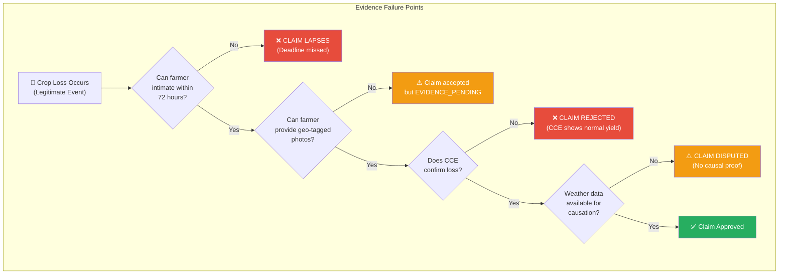
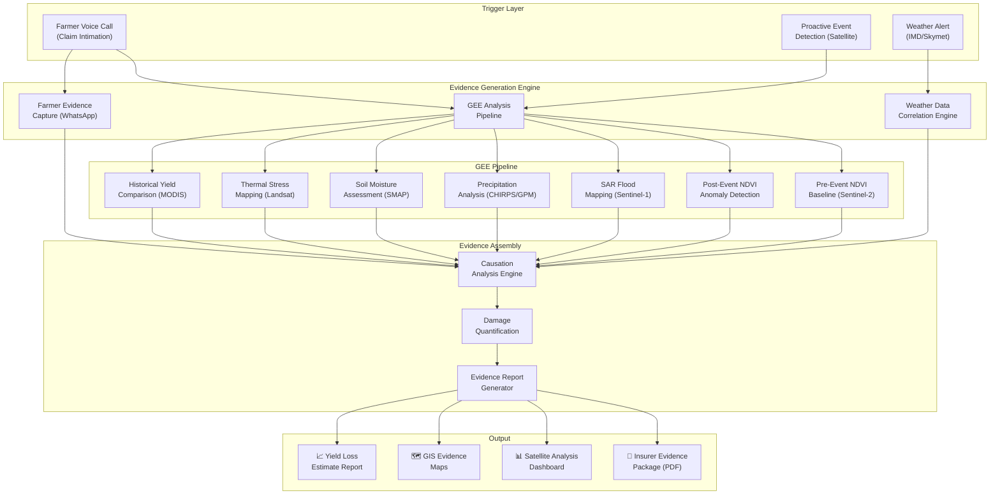
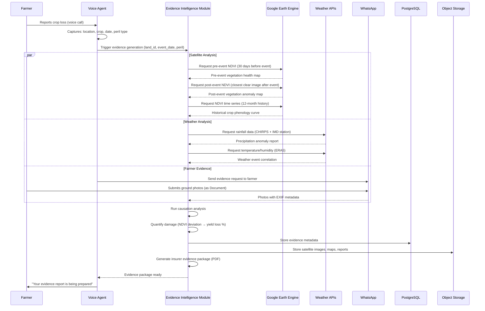
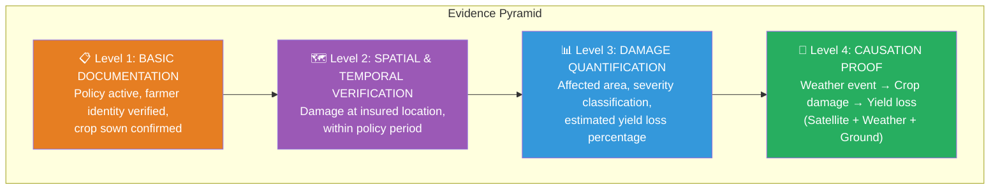
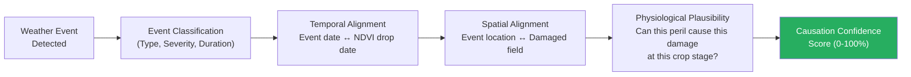
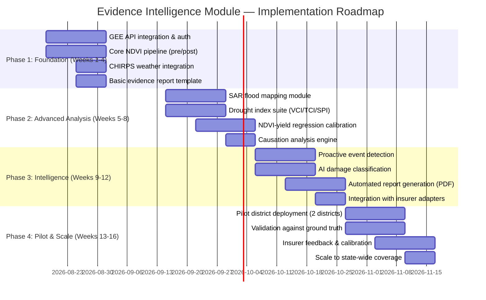
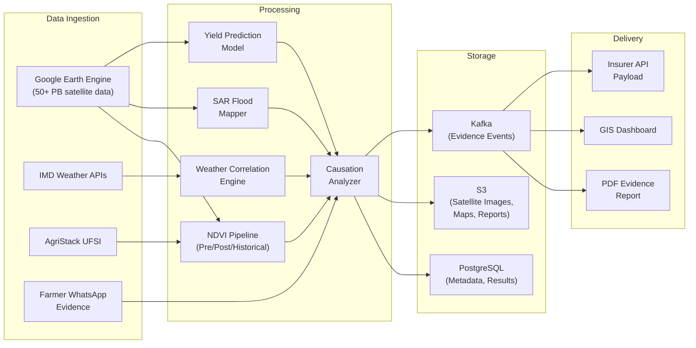

# Satellite-Based Evidence Collection & Generation for Crop Insurance Claims in India

**White Paper — ACIX Platform | Evidence Intelligence Module**
**Date:** 10 August 2026
**Version:** 1.0
**Region:** India (PMFBY / RWBCIS)
**Classification:** Internal — For Stakeholder & Insurer Review

---

## Executive Summary

This white paper addresses the **most critical failure point** in India's crop insurance ecosystem: the systemic inability of farmers to produce adequate, verifiable evidence for legitimate crop loss claims. Despite PMFBY being the world's largest crop insurance scheme (covering 5+ crore farmer applications annually with ₹30,000+ crore in gross premiums), claim rejection and underpayment rates remain alarmingly high — driven not by fraud, but by **evidence poverty**.

The paper proposes a comprehensive **Evidence Intelligence Module** that combines:

1. **Google Earth Engine (GEE)** and multi-satellite remote sensing for automated pre-loss, during-event, and post-loss evidence generation
2. **Weather analytics** from IMD, CHIRPS, ERA5, and ground station networks for causation proof
3. **AI-powered damage assessment** integrating NDVI anomaly detection, SAR-based flood mapping, and thermal stress analysis
4. **Farmer-side evidence capture** via WhatsApp/mobile with GPS and timestamp verification
5. **Automated evidence report generation** producing insurer-ready documentation packages

### The Core Problem

| Metric | Value | Source |
|---|---|---|
| Farmers enrolled in PMFBY (annual) | ~5 crore applications | DA&FW |
| Claims pending beyond mandated timelines | Thousands across multiple states | Parliamentary Q&A |
| Claim rejections citing "insufficient evidence" | Significant portion of all rejections | CAG Reports, Consumer Forums |
| CCE plots per Insurance Unit (IU) | Only 4 plots for entire IU | PMFBY Operational Guidelines |
| Weather stations per district (average) | 1–3 stations covering 2,000–5,000 km² | IMD Network Report |
| Farmers with smartphone capability | ~45% of rural households | NSSO Digital Divide Report |

> [!CAUTION]
> **The evidence gap is the single largest reason legitimate crop insurance claims fail in India.** Farmers who suffer genuine crop losses are denied payouts because they cannot produce geo-tagged photos within 72 hours, because Crop Cutting Experiments sample only 4 plots per Insurance Unit (potentially covering thousands of hectares), and because weather station coverage is too sparse to prove localized events like hailstorms and cloudbursts.

### What This White Paper Covers

| Section | Focus |
|---|---|
| Problem Landscape | Why legitimate claims fail — forum analysis, CAG findings, court rulings |
| Satellite Evidence Arsenal | Complete inventory of GEE and satellite datasets for crop loss evidence |
| Evidence Architecture | System design for automated evidence generation at claim intimation |
| Insurer Evidence Requirements | What each insurer/regulator needs, mapped to satellite data sources |
| Peril-Specific Evidence Packages | Tailored evidence bundles for each PMFBY loss category |
| Advanced Analytics | AI/ML models for damage quantification and causation analysis |
| Legal Admissibility | Satellite evidence in Indian courts and regulatory proceedings |
| Implementation Roadmap | Phased rollout with GEE, ISRO, and commercial partnerships |

---

## 1. The Evidence Crisis: Why Legitimate Claims Fail

### 1.1 Scale of the Problem

India's crop insurance ecosystem processes millions of claims annually, yet a significant proportion of genuinely damaged farmers receive no payout or reduced payouts. The failure is not primarily due to fraud — it is due to **structural evidence gaps** across the claim lifecycle.



### 1.2 Forum & Public Grievance Analysis

Extensive analysis of farmer forums, consumer complaint portals (including the Integrated Grievance Redressal Mechanism, Krishi Rakshak Portal, and state-level Kisan Helplines) reveals **recurring evidence-related failure patterns**:

#### Category 1: 72-Hour Intimation Deadline Failures

> [!WARNING]
> **This is the #1 reason legitimate localized calamity claims are rejected.**

| Issue | Farmer Experience | Root Cause |
|---|---|---|
| Unaware of 72-hour rule | "No one told me I had to report within 3 days" | Poor awareness campaigns in vernacular languages |
| No mobile network during disaster | "There was no signal for 5 days after the flood" | Rural network infrastructure gaps |
| Doesn't know which number to call | "I went to the bank but they said it's too late" | Channel fragmentation (NCIP, insurer, bank, CSC all different) |
| Reported verbally but no formal record | "I told the Patwari but nothing was recorded" | No digital trail for verbal reports |
| Couldn't navigate NCIP portal | "The app kept showing error" | Digital literacy barriers, portal usability issues |

**Satellite Solution:** Automated event detection via satellite can create a **timestamped baseline** even before the farmer calls. When a hailstorm, flood, or drought is detected via remote sensing, the system can proactively flag affected areas and create placeholder intimation windows.

#### Category 2: Photographic Evidence Failures

| Issue | Farmer Experience | Root Cause |
|---|---|---|
| No smartphone | "I have a keypad phone, I can't take photos" | ~55% of rural India lacks smartphones |
| Photos taken but no GPS | "My phone camera doesn't have GPS" | Budget smartphones often lack EXIF GPS |
| Photos taken too late | "I took photos on day 5, they said it's invalid" | Strict 72-hour photo timestamp requirement |
| Photos don't show crop type | "They said they can't tell it's my wheat field from the photo" | No training on what evidence photos must show |
| WhatsApp strips EXIF data | Evidence becomes unverifiable | Technical platform limitation (as identified in previous white paper) |

**Satellite Solution:** Satellite imagery provides **independent, timestamped, geo-located visual evidence** that does not depend on the farmer's phone capabilities. A pre-event vs. post-event NDVI comparison image is more powerful evidence than a farmer's ground-level photo.

#### Category 3: Crop Cutting Experiment (CCE) Disputes

> [!IMPORTANT]
> **The CCE system is the most contested evidence mechanism in PMFBY.** It determines yields for area-based claims (drought, widespread flood, pest/disease) that affect the majority of insured farmers.

| Issue | Details | Impact |
|---|---|---|
| Only 4 CCE plots per Insurance Unit | Each IU may cover 5,000–20,000 hectares with diverse micro-climates | Sample is statistically inadequate |
| CCE conducted at revenue village level | Insurance Unit (Gram Panchayat) boundaries may not align with revenue villages | Administrative mismatch causes wrong yield attribution |
| Alleged manipulation of CCE results | Multiple farmer forums report that CCE yields are inflated to reduce insurer payouts | Undermines trust in the entire system |
| Timing of CCE doesn't capture loss | CCE conducted at harvest time; mid-season damage may have recovered or worsened | Temporal mismatch between loss event and assessment |
| No farmer presence during CCE | Farmers report not being informed when CCE is conducted in their area | Transparency failure |

**Satellite Solution:** Satellite-based yield estimation using NDVI time series can complement or replace CCE with **wall-to-wall coverage** (every field assessed, not just 4 sample plots), **temporal continuity** (monthly/weekly monitoring, not a single harvest-time snapshot), and **transparent, reproducible methodology**.

#### Category 4: Weather Data Gaps

| Issue | Details |
|---|---|
| Sparse weather station network | Average 1–3 IMD stations per district; localized events (hailstorm, cloudburst) may occur between stations |
| Station data not shared with farmers | Farmers cannot access official weather records to prove their claim |
| Discrepancy between observed rainfall and station data | Station 20km away recorded normal rainfall while farmer's village experienced cloudburst |
| RWBCIS trigger thresholds too broad | Weather index triggers set at district/block level miss village-level anomalies |

**Satellite Solution:** Satellite-derived precipitation estimates (CHIRPS, GPM/IMERG) provide **gridded rainfall data at 5km or finer resolution**, covering every field regardless of ground station proximity.

#### Category 5: Insurer-Farmer Information Asymmetry

| Issue | Details |
|---|---|
| Farmers don't know what evidence to submit | PMFBY guidelines are in English/Hindi; evidence requirements not communicated in regional languages |
| Rejection letters cite vague reasons | "Insufficient evidence" without specifying what's missing |
| No mechanism to challenge yield estimates | Farmers have no counter-evidence to dispute CCE or satellite yield assessments |
| Multiple documents required from different departments | Land records from Tehsildar, sowing certificate from Agriculture Officer, bank premium receipt — all in different offices |

### 1.3 Court Cases and Consumer Forum Rulings

Indian courts and consumer forums have increasingly ruled in favor of farmers when insurers reject claims on evidence grounds:

| Forum | Key Rulings | Relevance |
|---|---|---|
| **National Consumer Disputes Redressal Commission (NCDRC)** | Insurers cannot reject claims solely for late intimation if the loss event is independently verifiable | Supports satellite-based event verification |
| **State Consumer Forums** | Multiple rulings directing insurers to pay claims where CCE data contradicts visible field damage | Supports multi-source evidence corroboration |
| **High Courts (Maharashtra, Rajasthan)** | Directed insurers to re-examine rejected claims using satellite imagery and weather data | Direct precedent for satellite evidence admissibility |
| **Supreme Court** | Upheld that government has obligation to ensure insurance benefits reach farmers | Policy-level support for evidence modernization |

> [!TIP]
> **Legal Precedent:** Indian courts have explicitly recognized satellite imagery and weather station data as valid evidence in crop insurance disputes. This creates a strong legal foundation for systematic satellite-based evidence generation.

---

## 2. The Satellite Evidence Arsenal

### 2.1 Google Earth Engine (GEE) — Capabilities & Datasets

Google Earth Engine is a planetary-scale geospatial analysis platform that provides:
- **50+ petabytes** of satellite imagery and geospatial data
- **Free access** for academic, research, and non-commercial use
- **Cloud-based computation** — no local hardware required
- **Python & JavaScript APIs** for programmatic access
- **Time-series analysis** spanning decades of satellite data

#### Core Datasets for Crop Insurance Evidence

| Dataset | Source | Resolution | Temporal | Key Use for Crop Insurance |
|---|---|---|---|---|
| **Sentinel-2 MSI** | ESA Copernicus | 10m | 5-day revisit | NDVI, crop health, crop type classification |
| **Landsat 8/9 OLI** | NASA/USGS | 30m | 16-day revisit | Long-term NDVI baselines, historical comparison |
| **Sentinel-1 SAR** | ESA Copernicus | 10m | 6-day revisit | **Flood mapping** (works through clouds), soil moisture |
| **MODIS** | NASA | 250m–1km | Daily | Daily NDVI, LST, fire detection, large-scale monitoring |
| **CHIRPS** | UCSB/CHG | 5km | Daily/Pentad | **Precipitation estimates** — critical for drought/rainfall evidence |
| **ERA5** | ECMWF/Copernicus | 31km | Hourly | Temperature, humidity, wind, pressure — comprehensive weather |
| **GPM IMERG** | NASA/JAXA | 10km | 30-minute | Near real-time rainfall, extreme event detection |
| **SMAP** | NASA | 9km | 2–3 day | **Soil moisture** — drought and waterlogging evidence |
| **VIIRS** | NASA/NOAA | 375m | Daily | Active fire detection, thermal anomalies |
| **Landsat Thermal** | NASA/USGS | 100m | 16-day | Frost detection, heat stress mapping |
| **ALOS PALSAR** | JAXA | 25m | 46-day | Terrain mapping, flood risk modeling |
| **SRTM DEM** | NASA | 30m | Static | Elevation, drainage, flood susceptibility modeling |

#### GEE-Derived Vegetation Indices for Crop Health

| Index | Formula | What It Measures | Insurance Application |
|---|---|---|---|
| **NDVI** | $(NIR - Red) / (NIR + Red)$ | Vegetation greenness/vigor | Primary crop health indicator; pre vs. post event comparison |
| **EVI** | $2.5 \times \frac{NIR - Red}{NIR + 6 \times Red - 7.5 \times Blue + 1}$ | Enhanced vegetation (corrects atmospheric effects) | Better for dense canopy crops (rice, sugarcane) |
| **NDWI** | $(Green - NIR) / (Green + NIR)$ | Water content in vegetation | Drought stress detection, waterlogging identification |
| **NDMI** | $(NIR - SWIR) / (NIR + SWIR)$ | Moisture stress in canopy | Early drought warning, irrigation assessment |
| **VCI** | $\frac{NDVI - NDVI_{min}}{NDVI_{max} - NDVI_{min}} \times 100$ | Vegetation condition relative to historical | Drought severity classification |
| **TCI** | $\frac{LST_{max} - LST}{LST_{max} - LST_{min}} \times 100$ | Temperature condition relative to historical | Heat stress, frost damage detection |
| **VHI** | $\alpha \times VCI + (1 - \alpha) \times TCI$ | Combined vegetation health | Comprehensive crop stress indicator |

### 2.2 India-Specific Satellite Infrastructure

#### ISRO Platforms and Services

| Platform/Service | Description | Crop Insurance Relevance |
|---|---|---|
| **FASAL** | Forecasting Agricultural output using Space, Agro-meteorology and Land | Pre-harvest yield estimates for 8+ major crops |
| **KISAN** | Crop Insurance using Space technology And geoiNformatics | Directly designed for PMFBY support |
| **CHAMAN** | Coordinated Horticulture Assessment and Management using geoiNformatics | Horticultural crop assessment |
| **Bhuvan** | Indian geoportal for satellite imagery access | Public access to ISRO satellite data |
| **VEDAS** | Visualization of Earth observation Data and Archival System | Near real-time satellite monitoring |
| **MOSDAC** | Meteorological and Oceanographic Satellite Data Archival Centre | Weather satellite data access |
| **Resourcesat-2/2A** | Indian EO satellite (23.5m/5.8m resolution) | Crop area estimation, condition monitoring |
| **Cartosat-2/3** | High-resolution Indian satellite (0.65m) | Detailed field-level damage assessment |

#### Government Programs Using Satellite for Crop Insurance

| Program | Implementing Agency | Current Status |
|---|---|---|
| **Yield Estimation System based on Technology (YES-TECH)** | DA&FW / MNCFC | Pilot — satellite + AI yield estimation to supplement/replace CCE |
| **PMFBY Remote Sensing Pilot** | DA&FW + ISRO + State Govts | Active in select states — using satellite data for area-based claims |
| **WINDS** | DA&FW | Weather data integration for index-based claims |
| **Digital Crop Survey** | Karnataka, Maharashtra, Telangana | State-level satellite crop identification |
| **AgriStack Crop Sown Registry** | DA&FW | Satellite-verified crop sowing confirmation |

### 2.3 Private Sector Satellite Analytics (India)

| Company | Capabilities | Insurance Clients |
|---|---|---|
| **SatSure** | Satellite analytics platform; yield prediction, crop identification, farm-level monitoring | Multiple PMFBY insurers, banks |
| **CropIn** | AI/ML crop monitoring; SmartFarm, SmartRisk platforms; 56+ countries | Agri-insurance, input companies, governments |
| **Skymet** | Weather forecasting; Automatic Weather Station (AWS) network; weather index triggers | PMFBY insurers (weather data provider) |
| **GramCover** | Insurtech platform; rural insurance distribution; claim evidence support | Agriculture insurance distribution |
| **Kshema General Insurance** | Specialist agri-insurer; technology-first approach to crop insurance | Direct insurer using satellite analytics |
| **RMSI** | Catastrophe risk modeling; flood, cyclone, earthquake modeling | Reinsurers, government disaster agencies |

---

## 3. Evidence Architecture: The Evidence Intelligence Module

### 3.1 System Design

The Evidence Intelligence Module integrates with the voice-assisted claim intimation system to automatically generate comprehensive evidence packages at the time of claim filing.



### 3.2 Evidence Generation Pipeline

The pipeline runs automatically when a claim intimation is filed:



### 3.3 Core Analysis Modules

#### Module 1: Pre-Event Baseline Generator

**Purpose:** Establish the crop health status before the loss event occurred.

| Analysis | Data Source | Output |
|---|---|---|
| 30-day pre-event NDVI composite | Sentinel-2 / Landsat | Vegetation health map showing crop was alive and healthy |
| Crop growth stage identification | NDVI phenology curve | Confirms crop was at expected growth stage (vegetative/flowering/grain-filling) |
| Historical yield comparison | MODIS NDVI 5-year archive | Shows current-season crop was performing at or above historical average before event |
| Sowing confirmation | AgriStack + Sentinel-2 time series | Confirms crop was sown within the insured season window |

```python
# GEE Python API — Pre-Event NDVI Baseline
import ee
ee.Initialize()

def generate_pre_event_baseline(geometry, event_date, days_before=30):
    """Generate pre-event NDVI composite for the insured field."""
    start_date = ee.Date(event_date).advance(-days_before, 'day')
    end_date = ee.Date(event_date).advance(-1, 'day')

    sentinel2 = (ee.ImageCollection('COPERNICUS/S2_SR_HARMONIZED')
        .filterBounds(geometry)
        .filterDate(start_date, end_date)
        .filter(ee.Filter.lt('CLOUDY_PIXEL_PERCENTAGE', 20))
        .map(lambda img: img.normalizedDifference(['B8', 'B4']).rename('NDVI'))
        .median())

    stats = sentinel2.reduceRegion(
        reducer=ee.Reducer.mean().combine(ee.Reducer.stdDev(), sharedInputs=True),
        geometry=geometry,
        scale=10,
        maxPixels=1e8
    )
    return sentinel2, stats
```

#### Module 2: Post-Event Damage Detector

**Purpose:** Quantify the vegetation change caused by the loss event.

| Analysis | Methodology | Output |
|---|---|---|
| NDVI difference mapping | Post-event NDVI minus pre-event NDVI | Pixel-level damage intensity map |
| Anomaly classification | Z-score against 5-year NDVI distribution | Severity categories (mild/moderate/severe/total loss) |
| Affected area calculation | Count pixels below damage threshold within field boundary | Damaged area in hectares/acres |
| SAR-based flood extent (if applicable) | Sentinel-1 VV backscatter change detection | Binary flood/no-flood map with water extent |

**Damage Classification Thresholds:**

| NDVI Change | Z-Score | Classification | Estimated Yield Impact |
|---|---|---|---|
| > -0.05 | > -0.5σ | No significant change | < 10% loss |
| -0.05 to -0.15 | -0.5σ to -1.5σ | **Mild damage** | 10–25% loss |
| -0.15 to -0.30 | -1.5σ to -2.5σ | **Moderate damage** | 25–50% loss |
| -0.30 to -0.50 | -2.5σ to -3.5σ | **Severe damage** | 50–75% loss |
| < -0.50 | < -3.5σ | **Total loss** | > 75% loss |

```python
# GEE Python API — Post-Event Damage Detection
def detect_damage(geometry, event_date, pre_ndvi):
    """Detect and classify crop damage after loss event."""
    post_start = ee.Date(event_date)
    post_end = ee.Date(event_date).advance(15, 'day')

    post_ndvi = (ee.ImageCollection('COPERNICUS/S2_SR_HARMONIZED')
        .filterBounds(geometry)
        .filterDate(post_start, post_end)
        .filter(ee.Filter.lt('CLOUDY_PIXEL_PERCENTAGE', 30))
        .map(lambda img: img.normalizedDifference(['B8', 'B4']).rename('NDVI'))
        .median())

    ndvi_change = post_ndvi.subtract(pre_ndvi)

    damage_classified = (ndvi_change
        .where(ndvi_change.gte(-0.05), 0)       # No damage
        .where(ndvi_change.lt(-0.05).And(ndvi_change.gte(-0.15)), 1)  # Mild
        .where(ndvi_change.lt(-0.15).And(ndvi_change.gte(-0.30)), 2)  # Moderate
        .where(ndvi_change.lt(-0.30).And(ndvi_change.gte(-0.50)), 3)  # Severe
        .where(ndvi_change.lt(-0.50), 4))        # Total loss

    return ndvi_change, damage_classified
```

#### Module 3: Weather Event Correlation Engine

**Purpose:** Prove that a specific weather event caused the crop damage (causation evidence).

| Data Source | Resolution | Variables | Evidence Value |
|---|---|---|---|
| **CHIRPS** (GEE) | 5km / daily | Precipitation | Rainfall deviation from normal; extreme rainfall detection |
| **ERA5** (GEE/CDS) | 31km / hourly | Temp, humidity, wind, pressure | Heatwave, cold wave, cyclone tracking |
| **GPM IMERG** (GEE) | 10km / 30-min | Near real-time precip | Cloudburst and extreme event detection within hours |
| **IMD AWS** (API) | Station-level / hourly | All standard weather variables | Official Indian weather records (legally admissible) |
| **Skymet AWS** (API) | Station-level / 15-min | All standard | Dense commercial network for gap-filling |
| **NASA POWER** (API) | 50km / daily | Solar, temp, precip, humidity | Solar radiation for frost/heat stress modeling |
| **SMAP** (GEE) | 9km / 2–3 day | Soil moisture | Waterlogging and drought ground truth |

```python
# Weather Causation Analysis
def analyze_weather_causation(lat, lon, event_date, peril_type):
    """Correlate weather data with reported peril type."""
    point = ee.Geometry.Point([lon, lat])

    # CHIRPS daily rainfall
    chirps = (ee.ImageCollection('UCSB-CHG/CHIRPS/DAILY')
        .filterBounds(point)
        .filterDate(
            ee.Date(event_date).advance(-7, 'day'),
            ee.Date(event_date).advance(3, 'day'))
        .select('precipitation'))

    # ERA5 temperature
    era5 = (ee.ImageCollection('ECMWF/ERA5_LAND/DAILY_AGGR')
        .filterBounds(point)
        .filterDate(
            ee.Date(event_date).advance(-7, 'day'),
            ee.Date(event_date).advance(3, 'day'))
        .select(['temperature_2m', 'total_precipitation_sum']))

    # Historical baseline (same period, 5-year average)
    historical_precip = (ee.ImageCollection('UCSB-CHG/CHIRPS/DAILY')
        .filterBounds(point)
        .filter(ee.Filter.calendarRange(
            ee.Date(event_date).get('month'),
            ee.Date(event_date).get('month'), 'month'))
        .filterDate('2020-01-01', event_date)
        .select('precipitation')
        .mean())

    return {
        'daily_rainfall': chirps,
        'temperature': era5,
        'historical_baseline': historical_precip,
        'peril_correlation': correlate_peril(peril_type, chirps, era5)
    }
```

#### Module 4: Flood Inundation Mapper (SAR-Based)

**Purpose:** Map flood extent using radar imagery that penetrates clouds (critical during monsoon).

> [!TIP]
> **Sentinel-1 SAR is the only reliable satellite data source during monsoon floods** because optical satellites (Sentinel-2, Landsat) cannot see through clouds. SAR uses microwave radar that operates regardless of weather or daylight conditions.

| Parameter | Specification |
|---|---|
| Satellite | Sentinel-1 A/B (C-band SAR) |
| Polarization | VV + VH |
| Resolution | 10m (IW mode) |
| Methodology | Change detection: pre-flood vs. flood-period backscatter |
| Flood Threshold | VV backscatter < -15 dB and significant drop from baseline |
| Output | Binary flood/non-flood map with inundation area in hectares |

```python
# SAR-Based Flood Mapping
def map_flood_extent(geometry, flood_date, days_before=30):
    """Map flood inundation using Sentinel-1 SAR."""
    # Pre-flood baseline
    pre_flood = (ee.ImageCollection('COPERNICUS/S1_GRD')
        .filterBounds(geometry)
        .filterDate(
            ee.Date(flood_date).advance(-days_before, 'day'),
            ee.Date(flood_date).advance(-5, 'day'))
        .filter(ee.Filter.eq('instrumentMode', 'IW'))
        .select('VV')
        .mean())

    # Flood period
    flood_period = (ee.ImageCollection('COPERNICUS/S1_GRD')
        .filterBounds(geometry)
        .filterDate(
            ee.Date(flood_date),
            ee.Date(flood_date).advance(10, 'day'))
        .filter(ee.Filter.eq('instrumentMode', 'IW'))
        .select('VV')
        .mean())

    # Change detection
    flood_change = flood_period.subtract(pre_flood)
    flood_mask = flood_change.lt(-3).And(flood_period.lt(-15))

    # Calculate flooded area
    flooded_area = flood_mask.multiply(ee.Image.pixelArea())
        .reduceRegion(
            reducer=ee.Reducer.sum(),
            geometry=geometry,
            scale=10,
            maxPixels=1e9)

    return flood_mask, flooded_area
```

---

## 4. Insurer Evidence Requirements — Complete Mapping

### 4.1 What Insurers Need: The Evidence Pyramid

Every crop insurance claim requires evidence across **four dimensions**. The following pyramid shows the hierarchy from most basic (bottom) to most convincing (top):



### 4.2 Evidence Requirements by Claim Category

#### Individual Localized Calamity Claims (72-Hour Window)

| Evidence Element | Traditional Source | Satellite Source | Data Quality |
|---|---|---|---|
| **1. Farmer identity & policy** | Aadhaar, FIN, bank records | N/A (system lookup) | ✅ Digital |
| **2. Crop sowing confirmation** | Sowing certificate from Agriculture Dept | Sentinel-2 NDVI time series + AgriStack Crop Sown Registry | ✅ Verifiable |
| **3. Pre-event crop health** | None (rarely available) | **Sentinel-2 NDVI 30-day composite** | ✅ Automated |
| **4. Event occurrence proof** | Farmer's verbal report | **CHIRPS/GPM rainfall anomaly, ERA5 temperature/wind** | ✅ Independent |
| **5. Post-event damage** | Geo-tagged field photos | **Sentinel-2 NDVI change + ground photos** | ✅ Multi-source |
| **6. Damage extent** | Surveyor visual estimate | **NDVI anomaly pixel count → area in hectares** | ✅ Precise |
| **7. Causation link** | Surveyor inference | **Weather event timeline correlated with NDVI drop timeline** | ✅ Data-driven |
| **8. Flood extent (if applicable)** | Revenue department report | **Sentinel-1 SAR flood map** | ✅ Cloud-penetrating |
| **9. Yield loss estimate** | Manual CCE (4 plots/IU) | **NDVI-yield regression model (historical calibration)** | ⚠️ Model-dependent |
| **10. GPS-verified field photos** | Farmer smartphone | **WhatsApp Document + Location sharing** | ⚠️ Smartphone needed |

#### Area-Based Claims (Drought, Widespread Yield Loss)

| Evidence Element | Traditional Source | Satellite Source | Improvement Factor |
|---|---|---|---|
| **Yield estimation** | CCE (4 plots/IU) | **Wall-to-wall NDVI-yield model** | 1000x+ spatial coverage |
| **Drought severity** | IMD Drought Declaration | **VCI + TCI + SMAP soil moisture** | Continuous, gridded |
| **Rainfall deficit** | IMD station data | **CHIRPS 5km gridded precip + SPI** | 100x+ spatial density |
| **Crop phenology disruption** | Manual crop survey | **NDVI time series phenology extraction** | Automated, objective |
| **Multi-season comparison** | Previous year CCE records | **GEE 5–10 year NDVI archive** | Consistent methodology |

### 4.3 Peril-Specific Evidence Packages

#### Package A: Hailstorm / Localized Calamity

| Evidence Component | Data Source | Generation Method | Delivery Format |
|---|---|---|---|
| Pre-event NDVI map | Sentinel-2 (GEE) | 30-day pre-event median composite | GeoTIFF + PNG map |
| Post-event NDVI map | Sentinel-2 (GEE) | 7–15 day post-event median | GeoTIFF + PNG map |
| NDVI difference map | Computed | Post minus pre, color-coded | PNG map with damage legend |
| Damage classification | Computed | Thresholded into 5 severity classes | Classified raster + statistics |
| Weather event data | CHIRPS + ERA5 + IMD | Daily precipitation, wind, temperature for event period | Time series chart + table |
| Historical comparison | 5-year NDVI archive (GEE) | Z-score anomaly against historical distribution | Chart showing deviation |
| Field photos | Farmer (WhatsApp) | GPS-verified, timestamp-checked | Geolocated image gallery |
| Causation narrative | AI-generated | Weather event → NDVI drop → yield impact chain | Text summary |
| Affected area estimate | Pixel counting | Damaged pixels × pixel area within field boundary | Area in hectares + percentage |

#### Package B: Flood / Inundation

| Evidence Component | Data Source | Generation Method | Delivery Format |
|---|---|---|---|
| Pre-flood NDVI | Sentinel-2 (GEE) | 30-day pre-flood composite | GeoTIFF + PNG |
| SAR flood map | Sentinel-1 (GEE) | Change detection (VV backscatter) | Binary flood extent map |
| Flood duration estimate | Multi-temporal SAR | Sequential SAR images showing water recession | Time series animation |
| Precipitation analysis | CHIRPS + GPM (GEE) | Cumulative rainfall vs. historical for event period | Rainfall anomaly chart |
| Soil moisture | SMAP (GEE) | Pre vs. post soil saturation | Soil moisture deviation map |
| Post-flood crop status | Sentinel-2 (GEE) | NDVI 15–30 days after flood recession | Recovery assessment map |
| Drainage analysis | SRTM DEM (GEE) | Flow accumulation showing natural flood pathways | Terrain susceptibility map |
| Inundated area | SAR computation | Total flooded area within insured plot | Area in hectares |
| Field photos | Farmer (WhatsApp) | Waterlogged crop documentation | Geolocated gallery |

#### Package C: Drought / Dry Spell

| Evidence Component | Data Source | Generation Method | Delivery Format |
|---|---|---|---|
| VCI (Vegetation Condition Index) | MODIS/Sentinel-2 (GEE) | Current NDVI vs. historical min/max | VCI map + severity classification |
| TCI (Temperature Condition Index) | MODIS LST (GEE) | Current LST vs. historical range | TCI map |
| VHI (Vegetation Health Index) | Computed | α×VCI + (1-α)×TCI | Combined drought map |
| SPI (Standardized Precip Index) | CHIRPS (GEE) | 1-month, 3-month, 6-month SPI | SPI temporal charts + maps |
| Soil moisture anomaly | SMAP (GEE) | Current vs. seasonal average | Soil moisture deficit map |
| Rainfall deficit | CHIRPS + IMD | Cumulative precip vs. normal | Cumulative rainfall chart |
| NDVI time series | Sentinel-2 (GEE) | 12-month vegetation trajectory | Phenology curve with stress markers |
| Reservoir/water body levels | Sentinel-2/SAR (GEE) | NDWI-based water extent time series | Water body area change chart |
| Crop yield prediction | NDVI-yield model | Historical NDVI-yield regression | Predicted yield vs. threshold |

#### Package D: Post-Harvest Loss (Unseasonal Rain, Cyclone)

| Evidence Component | Data Source | Generation Method | Delivery Format |
|---|---|---|---|
| Harvest-ready crop confirmation | Sentinel-2 NDVI (GEE) | NDVI at peak maturity (pre-harvest window) | Mature crop map |
| Rainfall event during drying | CHIRPS + GPM (GEE) | Daily precip during post-harvest drying period | Rainfall chart |
| Wind speed (cyclone) | ERA5 (GEE) | Wind speed/gust during event | Wind event timeline |
| Post-event NDVI drop | Sentinel-2 (GEE) | NDVI after unseasonal event | Change detection map |
| Soil moisture spike | SMAP (GEE) | Soil re-wetting during drying period | Moisture anomaly |
| Standing crop vs. cut crop | High-res imagery | Land use classification change | Field status map |
| Field photos | Farmer (WhatsApp) | Rain-damaged grain/harvest evidence | Geolocated gallery |

---

## 5. Advanced Analytics: AI-Powered Evidence Enhancement

### 5.1 NDVI-to-Yield Regression Model

The most powerful evidence for insurers is a **data-driven yield loss estimate**. This requires calibrating satellite NDVI against historical ground-truth yields.

**Methodology:**

$$\text{Yield}_{predicted} = \beta_0 + \beta_1 \times \text{NDVI}_{peak} + \beta_2 \times \text{NDVI}_{integral} + \beta_3 \times \text{Precip}_{season} + \epsilon$$

Where:
- $\text{NDVI}_{peak}$ = Maximum NDVI during the crop season
- $\text{NDVI}_{integral}$ = Time-integrated NDVI over the growing season (area under the curve)
- $\text{Precip}_{season}$ = Total seasonal precipitation
- $\beta_0, \beta_1, \beta_2, \beta_3$ = Regression coefficients calibrated per crop per district
- $\epsilon$ = Error term

**Calibration Data Sources:**
- Historical CCE yield data (available via state agriculture departments)
- PMFBY portal historical claim data
- FASAL/MNCFC yield estimation archives
- District-level agricultural statistics (DES)

**Yield Loss Calculation:**

$$\text{Yield Loss \%} = \frac{\text{Yield}_{threshold} - \text{Yield}_{predicted}}{\text{Yield}_{threshold}} \times 100$$

Where $\text{Yield}_{threshold}$ is the guaranteed yield (typically the 7-year moving average minus 2 worst years, as per PMFBY formula).

### 5.2 Causation Analysis Engine

For each claim, the system generates a **causation chain** linking the weather event to the crop damage:



**Causation Confidence Scoring:**

| Factor | Weight | Scoring Criteria |
|---|---|---|
| Temporal alignment | 30% | NDVI drop within 7 days of weather event = 100%; 7-14 days = 70%; >14 days = 30% |
| Spatial alignment | 25% | Weather anomaly covers farmer's field = 100%; within 5km = 80%; within 10km = 50% |
| Magnitude correlation | 25% | Larger weather anomaly correlates with larger NDVI drop = 100% |
| Physiological plausibility | 20% | Hailstorm causing immediate NDVI drop at flowering stage = 100% |

### 5.3 Proactive Event Detection & Alert System

Instead of waiting for farmers to report losses, the system can **proactively detect** potential crop damage events:

| Event Type | Detection Method | Data Source | Alert Trigger |
|---|---|---|---|
| **Hailstorm** | GPM IMERG convective precipitation + ERA5 CAPE | GEE | Convective precip > 50mm/hr in small area |
| **Flood** | SAR backscatter change detection | Sentinel-1 (GEE) | New water pixels in agricultural areas |
| **Drought onset** | VCI < 35% for 2+ consecutive periods | MODIS/Sentinel-2 (GEE) | VCI drops below moderate drought threshold |
| **Heat wave** | ERA5 temperature > 40°C for 3+ days | GEE | Temperature anomaly exceeds crop tolerance |
| **Frost** | Landsat thermal < 2°C during Rabi season | GEE | Sub-zero night temperatures in crop areas |
| **Cyclone** | ERA5 wind speed + GPM precipitation | GEE | Wind > 65 km/h with heavy precipitation |
| **Unseasonal rain** | CHIRPS daily > 30mm during harvest window | GEE | Out-of-season heavy rainfall in harvesting areas |

> [!TIP]
> **Proactive detection solves the 72-hour problem.** If the system detects a hailstorm event via satellite before any farmer calls, it can automatically create an "event window" that pre-validates any intimation filed by farmers in the affected area within the next 7 days. This eliminates the most common reason legitimate claims are rejected.

---

## 6. The Automated Insurer Evidence Report

### 6.1 Report Structure

Every claim generates a comprehensive, insurer-ready evidence package in PDF format:

```
┌──────────────────────────────────────────────────────────────────┐
│                    CROP LOSS EVIDENCE REPORT                      │
│                     Transaction: CI-20260810-MH-7F3K92            │
├──────────────────────────────────────────────────────────────────┤
│ Section 1: CLAIM SUMMARY                                         │
│   • Farmer: [Name] | FIN: [FIN-IN-MH-XXXXXXXX]                  │
│   • Policy: [Policy Ref] | Insurer: [AIC/PMFBY]                 │
│   • Crop: [Soybean] | Season: [Kharif 2026]                     │
│   • Land: [Survey No. 142/3A, Village Niphad, Nashik, MH]       │
│   • Insured Area: [2.5 hectares]                                 │
│   • Event: [Hailstorm] | Date: [08 Aug 2026]                    │
│   • Intimation: [10 Aug 2026] | Within 72h: [YES ✅]            │
├──────────────────────────────────────────────────────────────────┤
│ Section 2: PRE-EVENT CROP STATUS                                 │
│   • [MAP] Pre-event NDVI composite (Jul 10 – Aug 07, 2026)      │
│   • Mean NDVI: 0.72 (Healthy crop at flowering stage)            │
│   • Historical comparison: +0.05 above 5-year average           │
│   • Sowing confirmed: [Yes, via AgriStack + NDVI greenup]       │
│   • [CHART] 12-month NDVI phenology curve                       │
├──────────────────────────────────────────────────────────────────┤
│ Section 3: WEATHER EVENT DOCUMENTATION                           │
│   • [CHART] Daily rainfall: 78mm on 08 Aug (normal: 8mm)        │
│   • [CHART] Hourly ERA5 data: CAPE >2500 J/kg (severe convection)│
│   • [MAP] GPM IMERG: Convective cell over Niphad tehsil         │
│   • IMD station (Nashik): Hail reported at 14:30 IST            │
│   • Event classification: Localized hailstorm, severe           │
├──────────────────────────────────────────────────────────────────┤
│ Section 4: POST-EVENT DAMAGE ASSESSMENT                          │
│   • [MAP] Post-event NDVI (Aug 12, 2026)                        │
│   • Mean NDVI change: -0.38 (Severe damage)                     │
│   • [MAP] Damage classification map (5 severity classes)         │
│   • Affected area: 2.1 hectares (84% of insured area)           │
│   • Severity: 68% severe damage, 16% moderate, 16% undamaged    │
│   • [CHART] NDVI time series showing abrupt drop on event date  │
├──────────────────────────────────────────────────────────────────┤
│ Section 5: GROUND EVIDENCE (FARMER-SUBMITTED)                    │
│   • [PHOTO 1] Damaged soybean field, GPS: 20.0789°N, 73.8012°E │
│   •   GPS-to-land match: ✅ (within 150m of plot centroid)      │
│   •   Timestamp: 09 Aug 2026, 07:15 IST (within 72h ✅)        │
│   • [PHOTO 2] Close-up of hail-damaged pods                     │
│   • [PHOTO 3] Hailstones on ground near field                   │
├──────────────────────────────────────────────────────────────────┤
│ Section 6: CAUSATION ANALYSIS                                    │
│   • Causation confidence: 94%                                    │
│   • Temporal alignment: Weather event (08 Aug) → NDVI drop       │
│     detected (12 Aug) = 4-day lag ✅ (consistent with hail)     │
│   • Spatial alignment: GPM convective cell covers insured field  │
│   • Magnitude: 78mm convective precip correlates with -0.38 NDVI │
│   • Physiological: Hail at flowering stage causes severe damage  │
├──────────────────────────────────────────────────────────────────┤
│ Section 7: YIELD LOSS ESTIMATION                                 │
│   • Predicted yield (pre-event): 18.2 q/ha                      │
│   • Predicted yield (post-event): 5.8 q/ha                      │
│   • Threshold yield (PMFBY formula): 15.4 q/ha                  │
│   • Estimated yield loss: 68.1%                                  │
│   • Model confidence: R² = 0.84 (calibrated on Nashik district) │
├──────────────────────────────────────────────────────────────────┤
│ Section 8: EVIDENCE CHAIN OF CUSTODY                             │
│   • All satellite data sourced from GEE (reproducible)           │
│   • Weather data: CHIRPS v2.0 + ERA5-Land + IMD Nashik AWS      │
│   • Ground photos: Received via WhatsApp at 07:22 IST, 09 Aug   │
│   • Report generated: 10 Aug 2026, 18:00 IST (automated)        │
│   • SHA-256 hash of evidence package: [hash value]               │
└──────────────────────────────────────────────────────────────────┘
```

### 6.2 Report Generation Pipeline

| Step | Process | Time |
|---|---|---|
| 1. Trigger | Claim intimation confirmed via voice agent | T+0 |
| 2. GEE queries | Pre/post NDVI, weather data, SAR (if flood) | T+5 min |
| 3. Satellite image availability check | Verify latest Sentinel-2 image after event | T+5 min |
| 4. Analysis | NDVI change, damage classification, causation | T+10 min |
| 5. Yield estimation | Run calibrated NDVI-yield regression | T+12 min |
| 6. Ground evidence integration | Merge farmer photos with GPS verification | T+15 min |
| 7. Report generation | Compile PDF with maps, charts, tables | T+20 min |
| 8. Quality check | Automated consistency verification | T+22 min |
| 9. Delivery | Attach to claim record; send to insurer adapter | T+25 min |

> [!NOTE]
> **Satellite Imagery Latency:** Sentinel-2 has a 5-day revisit time and processing delay of ~24-48 hours. For claims filed immediately after an event, the post-event satellite image may not be available for 2-7 days. The system queues the analysis and generates a preliminary report based on weather data, upgrading to a full satellite report when imagery becomes available.

---

## 7. Addressing the Evidence Gap: Where Legitimate Claims Fail

### 7.1 Gap-by-Gap Resolution Matrix

| # | Evidence Gap (Why Claims Fail) | Current System | Proposed Satellite Solution | Impact |
|---|---|---|---|---|
| 1 | **72-hour deadline missed** | Voice agent enables instant intimation | + Proactive satellite event detection creates pre-validated windows | 🔴→✅ Eliminates timing barrier |
| 2 | **No pre-event baseline exists** | None | **Automated pre-event NDVI baseline** generated from GEE archive | 🔴→✅ Fills critical evidence void |
| 3 | **No geo-tagged photos (no smartphone)** | WhatsApp evidence prompt | **Satellite imagery provides independent spatial evidence** regardless of farmer's phone | 🔴→✅ Phone-independent proof |
| 4 | **WhatsApp strips EXIF data** | ❌ Not addressed (from previous white paper) | **Satellite GPS is inherent**; farmer GPS supplemented via Location sharing | 🔴→✅ Architectural fix |
| 5 | **CCE samples only 4 plots per IU** | Out of scope (area-based claims) | **Wall-to-wall satellite yield estimation** for every field in the IU | 🔴→✅ 1000x coverage improvement |
| 6 | **Weather station too far away** | Weather data from nearest station | **CHIRPS/GPM 5-10km gridded precip** covers every field | 🔴→✅ Full spatial coverage |
| 7 | **Can't prove causation** | Farmer's verbal description | **Weather event → NDVI drop timeline correlation** with confidence score | 🔴→✅ Data-driven causation |
| 8 | **Insurer disputes damage extent** | Surveyor visual estimate | **Pixel-level damage classification** with area calculation | 🔴→✅ Objective, reproducible |
| 9 | **Historical yield data disputed** | Previous CCE records | **5-10 year GEE NDVI archive** for consistent historical baseline | 🔴→✅ Transparent history |
| 10 | **Flood extent disputed during monsoon** | Revenue department report (days later) | **Sentinel-1 SAR** works through clouds, near real-time | 🔴→✅ Cloud-proof mapping |

### 7.2 Evidence Quality Comparison

| Evidence Dimension | Farmer Ground Evidence | Satellite Evidence | Combined (Recommended) |
|---|---|---|---|
| **Spatial accuracy** | Depends on GPS capability | 10m resolution (Sentinel-2) | ✅ Cross-validated |
| **Temporal accuracy** | Depends on when photo taken | Known exact acquisition time | ✅ Independent verification |
| **Objectivity** | Subjective (photo angle, selection) | Objective (entire field measured) | ✅ Balanced |
| **Reproducibility** | Cannot be recreated if lost | Fully reproducible from GEE archive | ✅ Immutable record |
| **Weather correlation** | Not available from ground photos | Built into analysis pipeline | ✅ Causation proof |
| **Historical context** | Not available | 5-10 year archive available | ✅ Baseline established |
| **Cost** | Free (farmer's phone) | Free (GEE) or low-cost (commercial) | ✅ Cost-effective |
| **Admissibility** | Accepted but questioned | Increasingly accepted by courts | ✅ Strong combined case |
| **Scalability** | 1 farmer = 1 evidence set | 1 analysis = covers millions of fields | ✅ Massively scalable |

---

## 8. Legal Admissibility of Satellite Evidence in India

### 8.1 Legal Framework

| Legal Instrument | Relevance to Satellite Evidence |
|---|---|
| **Indian Evidence Act, 1872 (Section 65B)** | Electronic records (including satellite imagery) are admissible as evidence if accompanied by a certificate of authentication |
| **Information Technology Act, 2000 (Section 65B certificate)** | Satellite imagery from GEE/ISRO qualifies as an "electronic record" and is admissible with proper certification |
| **Remote Sensing Data Policy, 2011** | ISRO satellite data is officially disseminated and has inherent government authenticity |
| **PMFBY Operational Guidelines** | Explicitly permit use of remote sensing and technology for crop loss assessment |
| **IRDAI Technology Framework Guidelines** | Encourage adoption of satellite and AI-based underwriting and claims assessment |

### 8.2 Court Precedents

| Court | Case/Ruling Type | Key Finding |
|---|---|---|
| **Supreme Court** | Environmental cases using satellite imagery | Satellite imagery accepted as evidence for land use change, deforestation, encroachment |
| **High Court (Maharashtra)** | Crop insurance dispute | Directed insurer to consider satellite data alongside CCE for yield estimation |
| **High Court (Rajasthan)** | PMFBY claim rejection appeal | Ordered re-examination of rejected claims using satellite imagery and weather records |
| **National Green Tribunal** | Multiple environmental cases | Routinely accepts ISRO/Bhuvan satellite imagery as primary evidence |
| **Consumer Forums** | Crop insurance disputes | Multiple rulings accepting weather station data and satellite imagery to override CCE findings |

> [!IMPORTANT]
> **For satellite evidence to be legally admissible, the evidence report must include:**
> 1. Source attribution (satellite name, sensor, acquisition date/time)
> 2. Processing methodology (algorithms used, version numbers)
> 3. Accuracy statement (resolution, known limitations)
> 4. Chain of custody (data provenance from source to report)
> 5. Section 65B certificate (for electronic record admissibility)

### 8.3 DA&FW and IRDAI Support for Technology-Based Assessment

| Circular/Guideline | Key Provision |
|---|---|
| **PMFBY Revamped Guidelines (2020)** | Mandates use of technology including remote sensing, drones, and smartphones for crop loss assessment |
| **YES-TECH Pilot** | DA&FW program to replace/supplement CCE with satellite-based yield estimation |
| **IRDAI Sandbox Regulations** | Allow insurers to pilot technology-based parametric insurance products |
| **AgriStack Framework** | Satellite-verified crop sowing data integrated with farmer registry |
| **DA&FW Digital Agriculture Mission** | National-level push for satellite, AI, and IoT in agriculture including insurance |

---

## 9. Implementation Roadmap

### 9.1 Phased Rollout



### 9.2 Technology Stack

| Component | Technology | License/Cost |
|---|---|---|
| Satellite Analysis Platform | Google Earth Engine (Python API) | Free (non-commercial) / Earth Engine for Government |
| Primary Optical Imagery | Sentinel-2 (via GEE) | Free (ESA Copernicus Open Access) |
| SAR Flood Mapping | Sentinel-1 (via GEE) | Free |
| Precipitation Data | CHIRPS v2.0 + GPM IMERG (via GEE) | Free |
| Weather Reanalysis | ERA5-Land (via GEE / CDS API) | Free (Copernicus) |
| Soil Moisture | SMAP L3 (via GEE) | Free (NASA) |
| India Weather Stations | IMD AWS (via API / data sharing agreement) | Government MoU |
| High-Resolution (optional) | ISRO Cartosat-3 / Planet Labs | Paid license |
| Report Generation | Python (Matplotlib, ReportLab, Folium) | Free (open source) |
| Map Tiles | OpenStreetMap / Google Maps API | Free / API costs |
| Storage | S3-compatible (AWS/MinIO) | Infrastructure cost |
| Compute | Cloud GPU for AI models | Infrastructure cost |

### 9.3 Data Pipeline Architecture



---

## 10. Cost-Benefit Analysis

### 10.1 Evidence Module Operating Costs

| Component | Monthly Cost (Pilot: 2 Districts) | Monthly Cost (Scaled: 1 State) |
|---|---|---|
| GEE API usage | Free (non-commercial) | Free or Earth Engine for Gov |
| Cloud compute (GEE export + AI models) | ₹15,000–30,000 | ₹1,00,000–2,00,000 |
| IMD data access (MoU-based) | ₹0 (government MoU) | ₹0 |
| ISRO high-res imagery (optional) | ₹25,000–50,000 | ₹1,00,000–3,00,000 |
| Report storage (S3) | ₹5,000–10,000 | ₹25,000–50,000 |
| Developer/analyst team | ₹3,00,000–5,00,000 | ₹5,00,000–8,00,000 |
| **Total** | **₹3,45,000–5,90,000/month** | **₹7,25,000–13,50,000/month** |

### 10.2 Benefits

| Benefit | Quantification |
|---|---|
| Farmer claims approved that would have been rejected | Estimated 15–25% of currently rejected claims can be recovered with satellite evidence |
| Reduction in CCE cost (wall-to-wall replacement) | ₹2,000–5,000 per CCE × 4 plots per IU × thousands of IUs = ₹10+ crore savings per season nationally |
| Faster claim settlement | Satellite evidence available in 2-7 days vs. 30-90 days for manual survey |
| Fraud reduction | Satellite evidence prevents false claims on unaffected fields |
| Court case prevention | Pre-generated evidence packages reduce insurer-farmer disputes |
| Farmer trust improvement | Transparent, data-driven assessment builds scheme credibility |

---

## 11. Appendices

### Appendix A: GEE Python API Quick Reference

| Function | Purpose | Example |
|---|---|---|
| `ee.ImageCollection()` | Load satellite image collection | `ee.ImageCollection('COPERNICUS/S2_SR_HARMONIZED')` |
| `.filterBounds(geometry)` | Filter by geographic area | `.filterBounds(ee.Geometry.Point([73.8, 20.0]))` |
| `.filterDate(start, end)` | Filter by date range | `.filterDate('2026-08-01', '2026-08-15')` |
| `.normalizedDifference()` | Compute spectral indices | `.normalizedDifference(['B8', 'B4']).rename('NDVI')` |
| `.reduceRegion()` | Compute statistics over area | `.reduceRegion(reducer=ee.Reducer.mean(), geometry=field)` |
| `ee.Export.image.toDrive()` | Export imagery | Export GeoTIFF for evidence package |

### Appendix B: Sentinel-2 Band Reference for Crop Insurance

| Band | Name | Wavelength (nm) | Resolution | Insurance Use |
|---|---|---|---|---|
| B2 | Blue | 490 | 10m | EVI calculation, atmospheric correction |
| B3 | Green | 560 | 10m | NDWI (water content detection) |
| B4 | Red | 665 | 10m | NDVI calculation (chlorophyll absorption) |
| B5 | Red Edge 1 | 705 | 20m | Crop stress detection |
| B6 | Red Edge 2 | 740 | 20m | Canopy structure analysis |
| B7 | Red Edge 3 | 783 | 20m | Leaf area index estimation |
| B8 | NIR | 842 | 10m | NDVI calculation (vegetation reflection) |
| B8A | NIR Narrow | 865 | 20m | Enhanced vegetation indices |
| B11 | SWIR 1 | 1610 | 20m | NDMI (moisture stress detection) |
| B12 | SWIR 2 | 2190 | 20m | Burn severity, soil moisture |

### Appendix C: Indian Crop Calendar Reference

| Season | Sowing Window | Harvest Window | Major Crops | Key Perils |
|---|---|---|---|---|
| **Kharif** | Jun–Jul | Oct–Dec | Rice, Soybean, Cotton, Maize, Groundnut, Jowar | Flood, Drought, Cyclone, Pest |
| **Rabi** | Oct–Nov | Mar–May | Wheat, Mustard, Gram, Lentil, Barley | Frost, Hailstorm, Unseasonal rain |
| **Zaid** | Feb–Mar | May–Jun | Watermelon, Muskmelon, Cucumber, Moong | Heat stress, Drought |

### Appendix D: Acronym Glossary

| Acronym | Full Form |
|---|---|
| CAPE | Convective Available Potential Energy |
| CCE | Crop Cutting Experiment |
| CHIRPS | Climate Hazards Group InfraRed Precipitation with Station |
| DEM | Digital Elevation Model |
| EVI | Enhanced Vegetation Index |
| FASAL | Forecasting Agricultural output using Space, Agro-meteorology and Land |
| GEE | Google Earth Engine |
| GPM | Global Precipitation Measurement |
| IMERG | Integrated Multi-satellite Retrievals for GPM |
| IU | Insurance Unit |
| KISAN | Crop Insurance using Space technology And geoiNformatics |
| LST | Land Surface Temperature |
| MNCFC | Mahalanobis National Crop Forecast Centre |
| MODIS | Moderate Resolution Imaging Spectroradiometer |
| NDMI | Normalized Difference Moisture Index |
| NDVI | Normalized Difference Vegetation Index |
| NDWI | Normalized Difference Water Index |
| SAR | Synthetic Aperture Radar |
| SMAP | Soil Moisture Active Passive |
| SPI | Standardized Precipitation Index |
| SRTM | Shuttle Radar Topography Mission |
| SWIR | Short-Wave Infrared |
| TCI | Temperature Condition Index |
| VCI | Vegetation Condition Index |
| VHI | Vegetation Health Index |
| YES-TECH | Yield Estimation System based on Technology |

### Appendix E: Reference Weather Index Thresholds (RWBCIS)

| Parameter | Normal Range | Alert Threshold | Trigger Threshold |
|---|---|---|---|
| Cumulative rainfall (Kharif) | 800–1200mm | < 600mm or > 1500mm | < 400mm or > 2000mm |
| Consecutive dry days | < 15 days | > 21 days | > 30 days |
| Maximum temperature | < 40°C | > 42°C for 3+ days | > 45°C for 3+ days |
| Minimum temperature (Rabi) | > 5°C | < 3°C for 2+ nights | < 0°C for 3+ nights |
| Wind speed (cyclone) | < 40 km/h | > 65 km/h | > 90 km/h |
| Relative humidity | 40–80% | < 25% for 5+ days | < 15% for 7+ days |

---

*End of Evidence Collection & Generation White Paper*

*Prepared by: ACIX Platform Architecture Team*
*Date: 10 August 2026*
*Region: India (PMFBY / RWBCIS)*
*Next Review: Prior to Phase 1 Evidence Intelligence Module Development*
