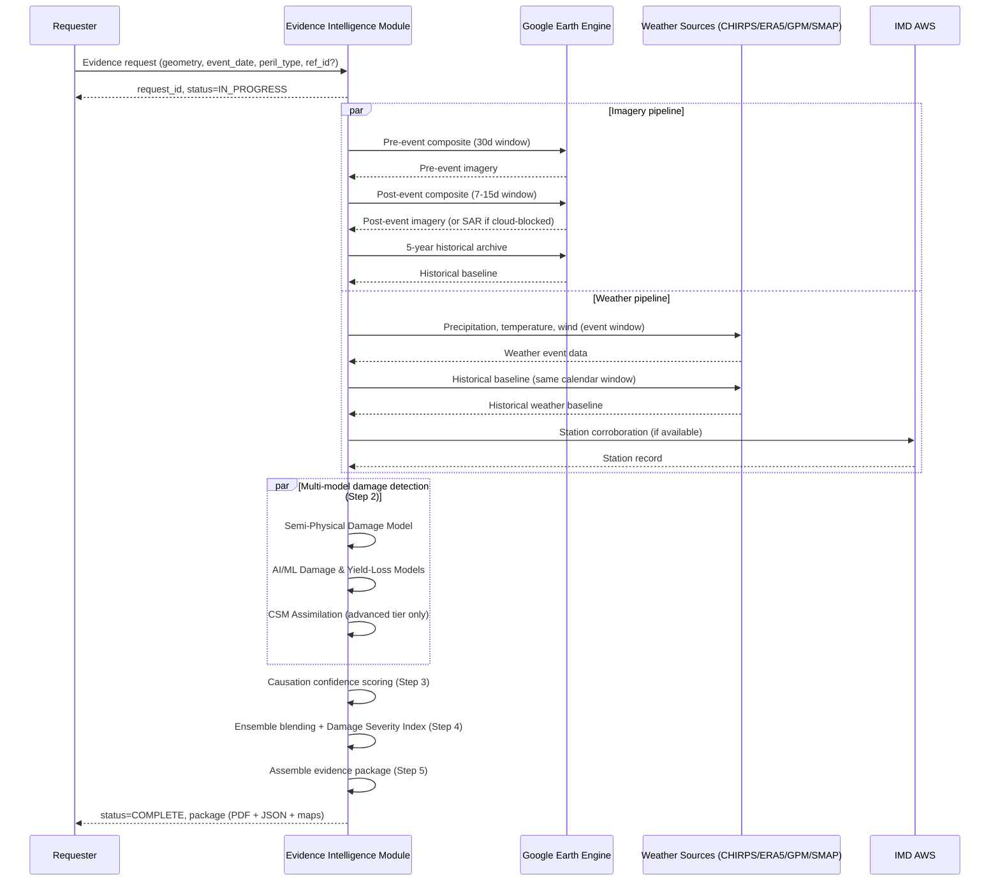

# Evidence Intelligence Module — Evidence Flow Specification

**Governed by:** [Constitution.md](./Constitution.md). **Implements:** [HLD.md](./HLD.md) §3 (Component Breakdown). This document goes one level deeper — the actual step-by-step processing pipeline.

---

## 1. Flow Overview & Actors

| Actor | Role |
|---|---|
| **Requester** | Any system calling the Evidence Request Interface (HLD §5) — voice-agent, web portal, CSC workflow, insurer system. Generic; not modeled by name. |
| **Evidence Intelligence Module** | This system — runs the pipeline below. |
| **Google Earth Engine** | Source of optical (Sentinel-2, Landsat) and SAR (Sentinel-1) imagery, plus hosted weather datasets (CHIRPS, ERA5, SMAP). |
| **IMD AWS** | Official station-level weather records, used to corroborate gridded weather sources. |

## 2. Trigger Input Contract

A pipeline run starts when a valid request arrives (HLD §5):

- `geometry` — the field boundary or representative point
- `event_date` — the claimed/reported date of the loss event
- `peril_type` — one of: `hailstorm`, `flood`, `drought`, `cyclone`, `unseasonal_rain`, `frost`, `heatwave`, `pest_disease_weather_induced`, `landslide`, `cloudburst`, `other`
- `external_reference_id` (optional) — opaque caller correlation key, not interpreted

If `peril_type` is `other` or ambiguous, the pipeline still runs a generic damage-detection + weather-anomaly pass (Steps 1–3) but skips peril-specific causation heuristics in Step 3.

## 3. Step 1 — Pre/Post-Event Imagery Acquisition

1. **Pre-event baseline**: query Sentinel-2 (10m, cloud filter <20%) for a 30-day window ending the day before `event_date`; if unavailable, fall back to Landsat 8/9 (30m).
2. **Post-event window**: query the same source for a 7–15 day window starting at `event_date`, taking the earliest sufficiently clear image.
3. **Historical baseline**: pull a 5-year archive of the same seasonal window for the same geometry, used later for anomaly scoring (Step 2) and yield-loss estimation (Step 4).
4. Record `source_dataset`, `source_version`, and `acquisition_date` against every image used — mandatory provenance (Constitution §2).

**Sowing/growth-stage sanity check:** the pre-event NDVI phenology curve is checked against the expected crop calendar window (Kharif/Rabi/Zaid) for the geometry's region to confirm a crop was plausibly standing before the claimed event — flagged, not blocked, if inconsistent.

## 4. Step 2 — Multi-Model Damage Detection

Round 1 of this module used a single NDVI-difference threshold table as the entire damage-detection engine. That is no longer sufficient — [Modeling-Approach.md](./Modeling-Approach.md) defines five components mirroring YES-TECH's own model-family structure, and this step runs them.

1. Compute NDVI/LSWI for pre-event and post-event composites — this remains the base spectral input every component consumes.
2. **Run in parallel:**
   - **Semi-Physical Damage Model** (Modeling-Approach.md §2) — RUE-chain expected-vs-observed biomass deviation.
   - **AI/ML Damage & Yield-Loss Models** (Modeling-Approach.md §3) — RF/DNN prediction over the documented feature set.
   - **CSM Assimilation** (Modeling-Approach.md §4) — advanced tier only, triggered for high-value/high-scrutiny claims.
3. **Flood/cloud-cover case**: if `peril_type` is `flood` or optical imagery is unusable (monsoon cloud cover), Sentinel-1 SAR change detection runs as an additional input to all three components above — pre-event vs. flood-period VV backscatter, threshold at <-15dB with a >3dB drop, producing a binary flood-extent map. This is the primary path during monsoon, not a fallback of last resort.
4. Each component's raw output — including the classification thresholds a component uses internally (e.g., the AI/ML model's own severity bands) — is stored independently in `model_component_results` (HLD §4), never overwritten by a later component's result.
5. Affected area is computed by counting damaged pixels (per the reconciled Ensemble output, Step 4 below) within the submitted geometry and multiplying by pixel area.

Every component's methodology is versioned (`methodology_version` in HLD §4) so a later recalibration doesn't silently change past reports' meaning.

## 5. Step 3 — Weather Correlation & Causation Analysis

1. Pull CHIRPS daily precipitation, ERA5-Land temperature/wind/humidity, and (for cloudburst/hailstorm) GPM IMERG near-real-time precipitation for a window from 7 days before to 3 days after `event_date`.
2. Compute the historical baseline for the same calendar window over the prior 5 years, same geometry.
3. Corroborate against IMD AWS station data where available (official record, strengthens admissibility per Constitution §2.4).
4. Score causation confidence (0–100) as a weighted combination:

| Factor | Weight | Criteria |
|---|---|---|
| Temporal alignment | 30% | NDVI drop within 7 days of the weather event = 100%; 7–14 days = 70%; >14 days = 30% |
| Spatial alignment | 25% | Weather anomaly covers the submitted geometry = 100%; within 5km = 80%; within 10km = 50% |
| Magnitude correlation | 25% | Larger weather anomaly correlates with larger NDVI drop |
| Physiological plausibility | 20% | Whether the peril type is capable of producing the observed damage pattern at the crop's inferred growth stage |

## 6. Step 4 — Ensemble Blending & Damage Severity Index

Two distinct outputs are produced here, answering different questions — both included in the evidence package, neither replacing the other:

1. **Ensemble yield-loss estimate** (Modeling-Approach.md §5): the Semi-Physical, AI/ML, and (where run) CSM Assimilation results from Step 2 are combined via weighted averaging or stacking, weighted by each component's own validation accuracy or calibration confidence — not a fixed a-priori split. Unlike YES-TECH, where a state commits to one model family for an entire season, this blending runs on every single request. The result carries a combined confidence figure derived from its inputs.
2. **Damage Severity Index** (Modeling-Approach.md §6): an entropy-weighted, Min-Max-normalized composite of NDVI/LSWI/SAR/FAPAR deviation and weather anomaly magnitude, computed against the field's own historical archive — CHF-inspired, but per-field rather than per-IU-group, and never blended with CCE data.

This is explicitly **not** a YES-TECH-style CCE-blended yield determination (Constitution §4) — both outputs are evidence components, always labeled as estimates, never presented as final indemnity-grade numbers. Every coefficient/weight used is versioned per crop/district/field-history and recorded in `methodology_version`.

## 7. Step 5 — Report/Package Generation & Legal Admissibility Packaging

Assembles Steps 1–4 into the Output Artifact (HLD §6). Every package includes, as mandatory fields (Constitution §2.4, Indian Evidence Act §65B):

1. Source attribution — dataset name, sensor, acquisition date/time for every image and weather data point used.
2. Processing methodology — algorithm/model names and the pinned `methodology_version`.
3. Accuracy statement — resolution, known limitations (e.g., cloud-cover gaps, regression R²).
4. Chain of custody — full provenance from source query to final report, plus a checksum.
5. Generation timestamp.

## 8. Failure / Fallback Paths

| Condition | Behavior |
|---|---|
| No cloud-free optical imagery within the post-event window | Fall back to SAR (Sentinel-1) if the peril is flood-compatible; otherwise mark `status = INSUFFICIENT_DATA`, deliver a weather-only preliminary package, and re-queue for full analysis once imagery becomes available |
| No historical baseline available for the geometry (e.g., first season of coverage) | Damage classification proceeds from pre/post-event comparison alone; anomaly-vs-history scoring is omitted and the report states this explicitly rather than fabricating a baseline |
| Causation confidence below a low-confidence threshold | Package is still delivered, clearly labeled with the low score — this module does not suppress or auto-reject; the consuming system decides what to do with a low-confidence package |
| GEE or weather API unavailable at request time | Request stays `IN_PROGRESS`, retried on a backoff schedule; `estimated_completion` is updated accordingly |

## 9. Sequence Diagram

