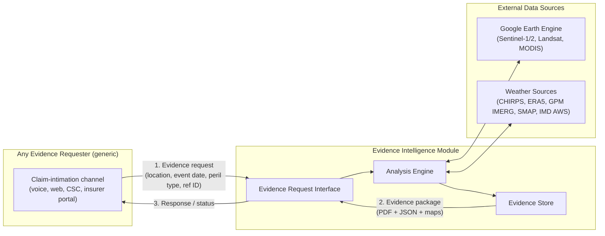

# Evidence Intelligence Module — High-Level Design

**Governed by:** [Constitution.md](./Constitution.md) — read that first; this document implements it and does not restate its boundaries.

---

## 1. Purpose & Position

The Evidence Intelligence Module is a standalone, consumer-agnostic service. It sits behind a generic evidence-request interface (Section 5) and can be called by any system that needs auditable satellite/weather evidence for a crop-loss event — a voice-agent claim-intimation system, a web portal, a CSC-assisted workflow, or an insurer's own claims platform. It has no privileged caller and no dependency on any other initiative's internal schema.

Conceptually it occupies the "Weather, satellite, and scheme reference sources" seam already anticipated in the broader platform's `baseline/HLD.md` integration layer — but this module is self-contained and does not require that platform to function; it can be called directly.

## 2. System Context



**Trigger input is generic on purpose** (Constitution §5): a geometry, an event date, a peril type, and an optional external reference ID a caller can use to correlate the response with its own record. The module never receives or requires a caller's internal claim ID, farmer ID, or policy schema.

## 3. Component Breakdown

| Component | Responsibility |
|---|---|
| **Evidence Request Interface** | Accepts requests, validates the input contract, returns a request ID immediately, and later serves the completed package or current status |
| **Imagery Ingestion** | Queries GEE for pre-event and post-event optical (Sentinel-2/Landsat) and, where needed, SAR (Sentinel-1) imagery for the requested geometry and date window |
| **Damage Detection Engine** | Computes NDVI/other indices, differences pre- vs. post-event, classifies damage severity, and (for flood) runs SAR backscatter change detection |
| **Weather Correlation Engine** | Pulls CHIRPS/ERA5/GPM/SMAP data for the event window and compares against historical baselines to characterize the weather event |
| **Causation Analysis Engine** | Scores temporal alignment, spatial alignment, magnitude correlation, and physiological plausibility between the weather event and the observed damage |
| **Yield-Loss Estimator** | Applies a calibrated NDVI-to-yield regression to produce a yield-loss estimate, explicitly labeled as an estimate (Constitution §4) |
| **Report/Package Generator** | Assembles all of the above into the Output Artifact (Section 6), including the mandatory §65B admissibility fields |
| **Evidence Store** | Persists request metadata, intermediate analysis results, and final packages against the retention principle in Constitution §7 |

## 4. Data Model

Owned entirely by this module — no foreign keys into any other initiative's schema.

### `evidence_requests`
| Field | Notes |
|---|---|
| `request_id` | Primary key |
| `geometry` | Field boundary or point, as submitted by the requester |
| `event_date` | Claimed/reported event date |
| `peril_type` | One of the supported peril categories (Section 7, Evidence-Flow-Spec.md) |
| `external_reference_id` | Optional, opaque — caller's own correlation key; never interpreted or validated by this module |
| `status` | `RECEIVED` \| `IN_PROGRESS` \| `COMPLETE` \| `INSUFFICIENT_DATA` \| `FAILED` |
| `requested_at`, `completed_at` | |

### `satellite_analysis_results`
| Field | Notes |
|---|---|
| `result_id`, `request_id` (FK) | |
| `source_dataset`, `source_version`, `acquisition_date` | Mandatory provenance fields (Constitution §2) |
| `pre_event_index_value`, `post_event_index_value`, `index_type` | e.g. NDVI |
| `damage_classification`, `affected_area_ha` | |
| `flood_extent_geometry` | Nullable — populated only when SAR flood mapping ran |

### `weather_correlation_results`
| Field | Notes |
|---|---|
| `result_id`, `request_id` (FK) | |
| `source_dataset`, `source_version` | e.g. CHIRPS v2.0, ERA5-Land |
| `observed_value`, `historical_baseline`, `anomaly_score` | |
| `causation_confidence_score` | 0–100, per Evidence-Flow-Spec.md §5 |

### `evidence_packages`
| Field | Notes |
|---|---|
| `package_id`, `request_id` (FK) | |
| `pdf_uri`, `json_uri`, `map_uris` | Object storage references |
| `methodology_version` | Pins the exact model/threshold version used (Constitution §2) |
| `checksum` | Integrity verification |
| `retention_expiry_date` | `generated_at` + 10 years (Constitution §7) |

## 5. Interface Contract

Generic request/response, deliberately decoupled from any caller's schema:

**Request**
```json
{
  "geometry": { "type": "Polygon", "coordinates": [ ... ] },
  "event_date": "2026-08-08",
  "peril_type": "hailstorm",
  "external_reference_id": "opaque-caller-key (optional)"
}
```

**Immediate response**
```json
{
  "request_id": "EIM-2026-0810-000472",
  "status": "IN_PROGRESS",
  "estimated_completion": "2026-08-10T18:00:00+05:30"
}
```

**Completed package response**
```json
{
  "request_id": "EIM-2026-0810-000472",
  "status": "COMPLETE",
  "package": {
    "pdf_uri": "...",
    "json_uri": "...",
    "map_uris": ["..."],
    "methodology_version": "v1.2.0",
    "causation_confidence_score": 94
  }
}
```

Status polling and/or a webhook callback are both acceptable integration patterns; neither is mandatory on the caller.

## 6. Output Artifact Spec

Every completed request produces:

1. **PDF Evidence Report** — human-readable, insurer-ready. Sections: claim/event summary, pre-event crop status, weather event documentation, post-event damage assessment, causation analysis, yield-loss estimation, and an evidence chain-of-custody section satisfying Evidence Act §65B (source attribution, methodology, accuracy statement, provenance, generation timestamp, checksum).
2. **Machine-readable JSON** — the same content, structured, for programmatic consumption by any caller.
3. **GIS Maps** — pre-event NDVI, post-event NDVI, damage-classification map, and (where applicable) SAR flood extent, as GeoTIFF + PNG.

## 7. Tech Stack & External Dependencies

| Component | Technology | Notes |
|---|---|---|
| Satellite analysis | Google Earth Engine (Python API) | Free tier for non-commercial/government use; Earth Engine for Government for production scale |
| Optical imagery | Sentinel-2 (primary), Landsat 8/9 (long-term baseline) | Via GEE |
| SAR imagery | Sentinel-1 | Via GEE; used for flood/cloud-cover cases |
| Precipitation | CHIRPS v2.0, GPM IMERG | Via GEE |
| Weather reanalysis | ERA5-Land | Via GEE / Copernicus CDS API |
| Soil moisture | SMAP L3 | Via GEE |
| Official weather records | IMD AWS | Via API / data-sharing agreement — used to corroborate, not substitute, gridded sources |
| Report generation | Python (Matplotlib/Folium for maps, ReportLab for PDF) | Open source |
| Object storage | S3-compatible | Evidence packages, imagery derivatives |
| Compute | Cloud-based; GEE handles heavy satellite compute server-side | |

## 8. Non-Functional Requirements

| Dimension | Requirement |
|---|---|
| Latency | Preliminary (weather-only) result within minutes of request; full satellite-inclusive package within the imagery revisit window (see Evidence-Flow-Spec.md §8 for the cloud-cover fallback path) |
| Reproducibility | Same request + same methodology version → same output, always |
| Auditability | Every field in a report traces to a named source dataset, version, and acquisition date |
| Availability | Degrades gracefully to weather-only evidence when satellite imagery is unavailable (never fails silently) |
| Cost | GEE usage free for non-commercial/government tiers; cost scales with compute for AI/regression models and storage, not with imagery licensing |

## 9. Explicit Boundaries

This module does not: ingest CCE data, implement yield-blending, run standalone predictive alerting, or read/write any other initiative's tables, topics, or tools. See [Constitution.md](./Constitution.md) §3–§5 for the reasoning; this section exists only as a pointer, not a restatement.
