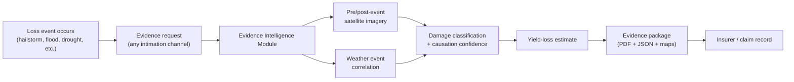

# Evidence Intelligence Module

**A satellite + weather evidence-generation service supporting crop-damage and yield-loss claims under PMFBY/RWBCIS.**

This is the orientation document — read this first. For the governing rules, see [Constitution.md](./Constitution.md); for the architecture, see [HLD.md](./HLD.md); for the modeling science, see [Modeling-Approach.md](./Modeling-Approach.md); for the step-by-step pipeline, see [Evidence-Flow-Spec.md](./Evidence-Flow-Spec.md).

---

## 1. Purpose

India's crop insurance ecosystem processes millions of claims a year, and a significant share of genuinely damaged farmers still receive no payout or a reduced one — not primarily because of fraud, but because of **structural evidence gaps**: missed reporting deadlines, no record of what the field looked like before the loss, sparse weather-station coverage, and no data-driven way to prove that a specific weather event caused the damage.

This module closes that gap by generating **reproducible, spatially explicit, auditable technical evidence** from satellite and weather data, independent of what a farmer's phone or a manual surveyor can capture.

## 2. The Problem, Briefly

| Failure point | Why it happens today |
|---|---|
| 72-hour intimation deadline missed | No independent record exists of the field's condition before or during the event — the farmer's report is the only evidence, and it's often late or absent |
| No geo-tagged photographic evidence | Roughly half of rural households lack a smartphone with reliable GPS-tagged photo capability |
| Crop Cutting Experiments sample too sparsely | Each Insurance Unit may cover thousands of hectares but is assessed via only a handful of manually cut plots |
| Weather station coverage too sparse | A district may have 1–3 stations; a localized hailstorm or cloudburst between them leaves no official record |
| Causation is asserted, not proven | A surveyor's inference that "this weather event caused this damage" has no data trail behind it |

Indian courts and consumer forums have increasingly accepted satellite imagery and weather-station data as valid evidence in crop-insurance disputes — this module is built to produce exactly that class of evidence, systematically, for every claim rather than only the ones that end up in court.

## 3. End-to-End Flow

This is deliberately a synthesis — see [Evidence-Flow-Spec.md](./Evidence-Flow-Spec.md) for the actual step-by-step pipeline (imagery acquisition windows, classification thresholds, causation scoring, fallback paths).

## 4. What This Fixes

This section is the point of this document: it maps each systemic evidence-gap failure point to what this module changes, generically — not against any other specific system's implementation.

| Gap | Before | With this module |
|---|---|---|
| No pre-event baseline exists | Nothing — assessment starts from the moment of the report | Automated 30-day pre-event NDVI baseline, generated from public satellite archives, for every claim |
| No geo-tagged photos (no smartphone) | Evidence depends entirely on the farmer's device capability | Satellite imagery provides independent, phone-independent spatial evidence at 10m resolution |
| Crop Cutting Experiments sample sparsely | A handful of plots represent an entire Insurance Unit | Wall-to-wall, per-field satellite coverage — every submitted geometry gets its own analysis |
| Weather station too far from the field | Nearest official station may be tens of kilometers away | Gridded precipitation/weather data (5–10km resolution) covers every field regardless of station proximity |
| Can't prove causation | A surveyor's inference, with no data behind it | A scored causation-confidence figure (temporal, spatial, magnitude, physiological alignment), fully explained in every report |
| Damage extent is a visual estimate | Subjective surveyor judgment | Pixel-level damage classification with a computed affected area |
| Evidence isn't reproducible or auditable | Once a surveyor's report is filed, it can't be independently re-derived | Every figure traces to a named, dated, versioned public data source; the same request re-run later yields the same result |

## 5. Explicit Boundaries

- **CCE is out of scope.** This module does not touch Crop Cutting Experiments or the CCE-based yield-determination process. See [Constitution.md](./Constitution.md) §4.
- **Prediction is out of scope, for now.** This module reacts to a reported event; it does not run standalone proactive/predictive alerting. See Constitution §3.
- **Standalone by design.** This module exposes a generic evidence-request contract and integrates with no specific claim-intimation channel's internals. See Constitution §5.

## 6. Standards Alignment

`YESTECH_Manual_2023.md` — the DA&FW/MNCFC government manual governing technology-based yield estimation under PMFBY — sets the bar this module targets: at least the same modeling rigor, and more robust where practical. YES-TECH mandates five documented modeling approaches (semi-physical, AI/ML, crop simulation, ensemble, and a parametric composite index); this module implements the same five-model-family structure, re-purposed for per-field damage/evidence scoring rather than IU-level CCE-blended yield — see [Modeling-Approach.md](./Modeling-Approach.md) for the full mapping, including where this module is deliberately more robust (always ensembling, per-field granularity, near-real-time cadence). It adopts that rigor without adopting YES-TECH's CCE-blending formula or its MITR/TIP governance structure, which apply to a different, formally constituted program. See [Constitution.md](./Constitution.md) §6 for the full posture.

## 7. Reading Order / Document Map

1. **This document** — orientation and what's being fixed.
2. **[Constitution.md](./Constitution.md)** — the non-negotiables and scope boundaries everything else must respect.
3. **[HLD.md](./HLD.md)** — system architecture: components, data model, interface contract, tech stack.
4. **[Modeling-Approach.md](./Modeling-Approach.md)** — the modeling science: five components mirroring and exceeding YES-TECH's own model-family structure.
5. **[Evidence-Flow-Spec.md](./Evidence-Flow-Spec.md)** — the detailed pipeline, step by step, including fallback paths.
6. **`../../documentation/Evidence-Collection-Generation-White-Paper.md`** — the original research/business-case white paper this initiative is derived from (peril-specific evidence packages, legal admissibility detail, cost-benefit analysis).

## 8. Roadmap Pointer

Indicative phasing (detail and dates to be owned by delivery planning, not restated here):

1. **Foundation** — GEE integration, core NDVI pre/post-event pipeline, CHIRPS weather integration, basic report template.
2. **Advanced analysis** — SAR flood mapping, drought index suite, NDVI-yield regression calibration, causation scoring engine.
3. **Packaging & delivery** — automated PDF/JSON generation, GIS map exports, the full §65B-compliant evidence package.
4. **Pilot & validation** — run against real claims in a small number of districts, validate outputs against ground truth, calibrate thresholds before wider rollout.
