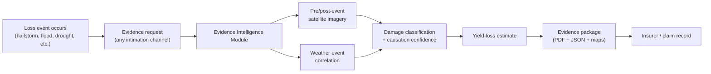

# Evidence Intelligence Module

**Start here — this is the orientation document for this repo's one active initiative.**

**Goal, in one sentence:** turn heterogeneous satellite and weather observations into reproducible, spatially explicit, auditable technical evidence that supports crop-damage and yield-loss claims under PMFBY/RWBCIS — starting with satellite + weather only; CCE and any specific intimation channel are explicitly out of scope for now.

For the governing rules, see [`initiatives/evidence-intelligence-module/Constitution.md`](initiatives/evidence-intelligence-module/Constitution.md); for the architecture, see [`HLD.md`](initiatives/evidence-intelligence-module/HLD.md); for the modeling science, see [`Modeling-Approach.md`](initiatives/evidence-intelligence-module/Modeling-Approach.md); for the step-by-step pipeline, see [`Evidence-Flow-Spec.md`](initiatives/evidence-intelligence-module/Evidence-Flow-Spec.md). Earlier platform material (a broader baseline platform design and a voice-assisted claim-intimation initiative) was removed as out of scope; it's recoverable from git history if ever needed.

---

## 1. Purpose

India's crop insurance ecosystem processes millions of claims a year, and a significant share of genuinely damaged farmers still receive no payout or a reduced one — not primarily because of fraud, but because of **structural evidence gaps**: missed reporting deadlines, no record of what the field looked like before the loss, sparse weather-station coverage, and no data-driven way to prove that a specific weather event caused the damage.

This module closes that gap by generating **reproducible, spatially explicit, auditable technical evidence** from satellite and weather data, independent of what a farmer's phone or a manual surveyor can capture.

## 2. The Problem, Briefly

| Failure point | Why it happens today |
|---|---|
| 72-hour intimation deadline missed | No independent record exists of the field's condition before or during the event — the farmer's report is the only evidence, and it's often late or absent |
| No geo-tagged photographic evidence | Roughly half of rural households lack a smartphone with reliable GPS-tagged photo capability |
| Crop Cutting Experiments sample too sparsely | Each Insurance Unit may cover thousands of hectares but is assessed via only a handful of manually cut plots |
| Weather station coverage too sparse | A district may have 1–3 stations; a localized hailstorm or cloudburst between them leaves no official record |
| Causation is asserted, not proven | A surveyor's inference that "this weather event caused this damage" has no data trail behind it |

Indian courts and consumer forums have increasingly accepted satellite imagery and weather-station data as valid evidence in crop-insurance disputes — this module is built to produce exactly that class of evidence, systematically, for every claim rather than only the ones that end up in court.

## 3. End-to-End Flow

This is deliberately a synthesis — see [`Evidence-Flow-Spec.md`](initiatives/evidence-intelligence-module/Evidence-Flow-Spec.md) for the actual step-by-step pipeline (imagery acquisition windows, classification thresholds, causation scoring, fallback paths).

## 4. What This Fixes

This section is the point of this document: it maps each systemic evidence-gap failure point to what this module changes, generically — not against any other specific system's implementation.

| Gap | Before | With this module |
|---|---|---|
| No pre-event baseline exists | Nothing — assessment starts from the moment of the report | Automated 30-day pre-event NDVI baseline, generated from public satellite archives, for every claim |
| No geo-tagged photos (no smartphone) | Evidence depends entirely on the farmer's device capability | Satellite imagery provides independent, phone-independent spatial evidence at 10m resolution |
| Crop Cutting Experiments sample sparsely | A handful of plots represent an entire Insurance Unit | Wall-to-wall, per-field satellite coverage — every submitted geometry gets its own analysis |
| Weather station too far from the field | Nearest official station may be tens of kilometers away | Gridded precipitation/weather data (5–10km resolution) covers every field regardless of station proximity |
| Can't prove causation | A surveyor's inference, with no data behind it | A scored causation-confidence figure (temporal, spatial, magnitude, physiological alignment), fully explained in every report |
| Damage extent is a visual estimate | Subjective surveyor judgment | Pixel-level damage classification with a computed affected area |
| Evidence isn't reproducible or auditable | Once a surveyor's report is filed, it can't be independently re-derived | Every figure traces to a named, dated, versioned public data source; the same request re-run later yields the same result |

## 5. Explicit Boundaries

- **CCE is out of scope.** This module does not touch Crop Cutting Experiments or the CCE-based yield-determination process. See [Constitution.md](initiatives/evidence-intelligence-module/Constitution.md) §4.
- **Prediction is out of scope, for now.** This module reacts to a reported event; it does not run standalone proactive/predictive alerting. See Constitution §3.
- **Standalone by design.** This module exposes a generic evidence-request contract and integrates with no specific claim-intimation channel's internals. See Constitution §5.

## 6. Standards Alignment

One line: this module targets at least [`YESTECH_Manual_2023.md`](initiatives/evidence-intelligence-module/standards/YESTECH_Manual_2023.md)'s modeling rigor, and exceeds it where practical (always-ensemble, per-field granularity, near-real-time cadence) — without adopting its CCE-blending formula or MITR/TIP governance, which govern a different, formally constituted program. Full posture and the adopted/not-adopted list live in [Constitution.md](initiatives/evidence-intelligence-module/Constitution.md) §6, not repeated here; the model-by-model mapping lives in [Modeling-Approach.md](initiatives/evidence-intelligence-module/Modeling-Approach.md).

## 7. Reading Order / Document Map

1. **This document** — orientation and what's being fixed.
2. **[Constitution.md](initiatives/evidence-intelligence-module/Constitution.md)** — the non-negotiables and scope boundaries everything else must respect.
3. **[HLD.md](initiatives/evidence-intelligence-module/HLD.md)** — system architecture: components, data model, interface contract, tech stack.
4. **[Modeling-Approach.md](initiatives/evidence-intelligence-module/Modeling-Approach.md)** — the modeling science: five components mirroring and exceeding YES-TECH's own model-family structure.
5. **[Evidence-Flow-Spec.md](initiatives/evidence-intelligence-module/Evidence-Flow-Spec.md)** — the detailed pipeline, step by step, including fallback paths.
6. **[`research/Evidence-Collection-Generation-White-Paper.md`](initiatives/evidence-intelligence-module/research/Evidence-Collection-Generation-White-Paper.md)** — the original research/business-case white paper this initiative is derived from (peril-specific evidence packages, legal admissibility detail, cost-benefit analysis). Optional deep-dive, not required to understand the goal.
7. **[`research/Remote-Sensing-ML-Techniques-Reference.md`](initiatives/evidence-intelligence-module/research/Remote-Sensing-ML-Techniques-Reference.md)** — remote-sensing and ML techniques extracted from an external SaaS platform pitch that was evaluated and rejected on scope (CCE blending, predictive alerting, SaaS framing) but contained reusable technical ideas. Reference only, not a design spec.
8. **[`notes/decision-log.md`](initiatives/evidence-intelligence-module/notes/decision-log.md)** — running decision log. Read only if you need the history behind a decision or why something that once existed no longer does.

## 8. Roadmap Pointer

Indicative phasing (detail and dates to be owned by delivery planning, not restated here):

1. **Foundation** — GEE integration, core NDVI pre/post-event pipeline, CHIRPS weather integration, basic report template.
2. **Advanced analysis** — SAR flood mapping, drought index suite, NDVI-yield regression calibration, causation scoring engine.
3. **Packaging & delivery** — automated PDF/JSON generation, GIS map exports, the full §65B-compliant evidence package.
4. **Pilot & validation** — run against real claims in a small number of districts, validate outputs against ground truth, calibrate thresholds before wider rollout.

## Directory Guide

Everything above lives under [`initiatives/evidence-intelligence-module/`](initiatives/evidence-intelligence-module/):

| Location | What's in it |
|---|---|
| `Constitution.md`, `HLD.md`, `Modeling-Approach.md`, `Evidence-Flow-Spec.md` | The design docs the Reading Order above walks through |
| [`standards/`](initiatives/evidence-intelligence-module/standards/) | `YESTECH_Manual_2023.md` (verbatim, unedited) — an **external, authoritative** government manual, kept visibly separate from anything this team authored |
| [`research/`](initiatives/evidence-intelligence-module/research/) | The original Evidence Collection & Generation white paper, plus a trimmed remote-sensing/ML technique reference — **internal** source research this initiative was derived from |
| [`notes/decision-log.md`](initiatives/evidence-intelligence-module/notes/decision-log.md) | Running decision log |

This repo holds a single active initiative, so everything belonging to it lives together in one directory rather than scattered across sibling top-level folders.

## Turning This Into Code

This document and everything it points to is the *what and why* — hand-authored, changes rarely. The *how it gets built* lives separately, in [`specs/001-evidence-generation-pipeline/`](../specs/001-evidence-generation-pipeline/) at the repo root: a Spec Kit feature directory (`spec.md` → `plan.md` → `tasks.md`) that translates `HLD.md` into a concrete, executable implementation plan, built out in [`src/`](../src/). Kept as separate trees deliberately — `specs/` is generated/updated via `/speckit-*` skills rather than written by hand, and `src/` is the actual running code; both change at a different cadence than the documents above.
