# Evidence Intelligence Module — Technical Flow & Architecture Diagrams

**What this is:** the *as-built* technical behaviour of the running service in [`src/`](../src/), drawn as
Mermaid diagrams. Control flow, data flow, decision gates, model wiring, epistemic state
(measured / substituted / absent), persistence, and configuration — not a file or module tree.

**How it relates to the other documents.** [`hld.md`](hld.md) is the source of truth for the
*intended* architecture and [`evidence-flow-spec.md`](evidence-flow-spec.md) for the *intended*
pipeline; both are hand-authored and change rarely. This document is derived from the code and
therefore describes what actually executes today, including the places where the implementation is
thinner than the design (§15 indexes them). Where the two disagree, the design documents state the
target and this one states the current state — neither overrides the other.

Every diagram is annotated with the file and line the behaviour comes from. Re-derive it by reading
those; there is no generator.

---

## 1. Runtime topology

What exists at run time, in one process, and what it talks to.

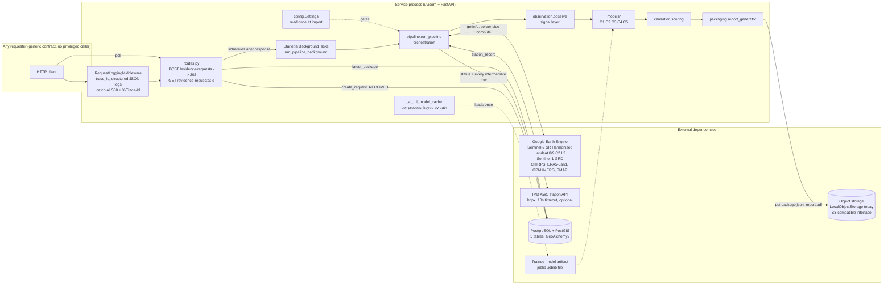

| Aspect | As built |
|---|---|
| Concurrency model | Single process; analysis runs in Starlette's in-process background task, not a queue or worker pool ([routes.py:88](../src/evidence_intelligence/api/routes.py#L88)) |
| GEE session | Module-level `_initialized` flag; one `ee.Initialize` per process ([gee_client.py:104](../src/evidence_intelligence/ingestion/gee_client.py#L104)) |
| DB session | Module-level engine/sessionmaker built from `default_settings.database_url` — `get_session` does not read the injected `Settings`, so a test/settings override changes model gates but not the database it points at ([dependencies.py:20](../src/evidence_intelligence/api/dependencies.py#L20)) |
| Session lifetime vs background work | The `EvidenceStore` handed to the background task comes from a `yield` dependency, whose teardown (`session.close()`) runs before background tasks on FastAPI ≥ 0.106. SQLAlchemy sessions stay usable after `close()`, so pipeline writes land in fresh transactions rather than the request's — worth confirming against a live Postgres, since the suite injects `FakeEvidenceStore` and cannot observe it |
| Config | `settings = load_settings()` executes at import ([config.py:91](../src/evidence_intelligence/config.py#L91)); env changes need a restart |
| Model artifact | Loaded lazily and cached per path; a load failure logs and degrades to the untrained placeholder rather than raising ([pipeline.py:58](../src/evidence_intelligence/pipeline.py#L58)) |

## 2. Request lifecycle — status machine

The five `RequestStatus` values and exactly what moves between them.

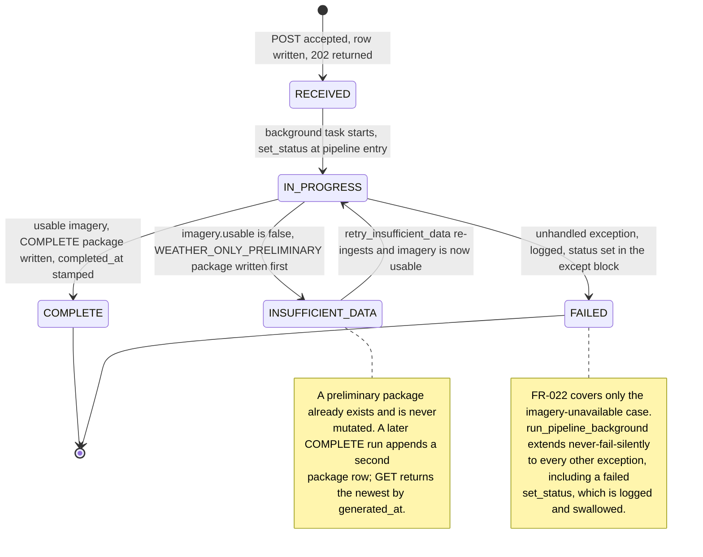

| Aspect | As built |
|---|---|
| `RECEIVED` is momentary | Written by `create_request`, overwritten by the pipeline's first statement ([pipeline.py:240](../src/evidence_intelligence/pipeline.py#L240)) |
| Retry trigger | `retry_insufficient_data` exists and is tested, but nothing in `src/` schedules it — no cron, queue, or scheduler is wired ([pipeline.py:689](../src/evidence_intelligence/pipeline.py#L689)) |
| `estimated_completion` | 10 minutes normally, 24 hours while `INSUFFICIENT_DATA`; declared operational estimates, not evidentiary figures ([routes.py:25](../src/evidence_intelligence/api/routes.py#L25)) |
| Immutability | No component, weather, satellite, or package row is ever updated in place — every stage inserts ([evidence_store.py:111](../src/evidence_intelligence/store/evidence_store.py#L111), [:194](../src/evidence_intelligence/store/evidence_store.py#L194)) |

## 3. End-to-end sequence, as built

The intended sequence is [`evidence-flow-spec.md` §9](evidence-flow-spec.md). This is the executed
one, including where control returns to the caller and where each row is written.

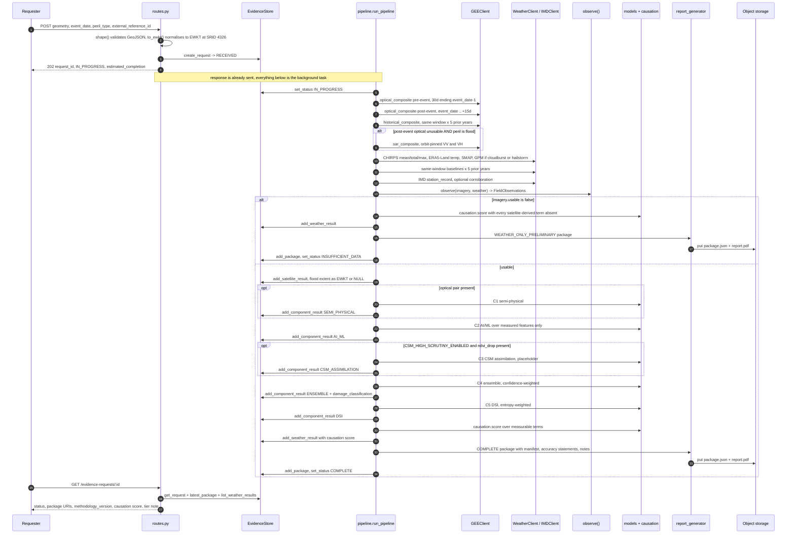

## 4. The tier decision — which kind of package a request gets

One branch decides everything downstream: whether the field was seen at all, and by what sensor.

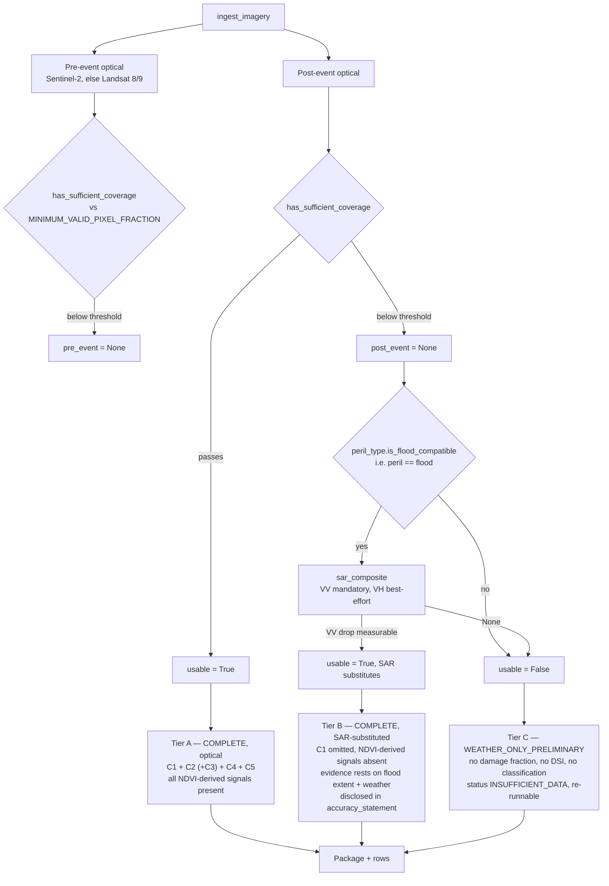

| Aspect | As built |
|---|---|
| Coverage gate is inert by default | `minimum_valid_pixel_fraction` is `None` unless a deployment sets it; coverage is always measured and disclosed, and only *suppresses* a composite once a value exists ([imagery.py:32](../src/evidence_intelligence/ingestion/imagery.py#L32)) |
| Unknown coverage ≠ zero coverage | A composite whose fraction could not be measured passes the gate and is disclosed as "coverage not measured" |
| SAR is not a general fallback | Only `PerilType.FLOOD` reaches it; drought, heatwave, hailstorm etc. fall through to Tier C ([schema.py:40](../src/evidence_intelligence/store/schema.py#L40)) |
| Tier B honesty rule | SAR yields no NDVI-equivalent, so Component 1 and every NDVI-derived signal stay absent instead of being estimated from a substituted value ([pipeline.py:522](../src/evidence_intelligence/pipeline.py#L522)) |
| Tier C is never a bare failure | A weather-only package with full §65B fields is still generated and stored ([pipeline.py:600](../src/evidence_intelligence/pipeline.py#L600)) |

## 5. Imagery ingestion internals (Earth Engine)

Where the pixels come from and what is computed server-side before anything reaches Python.

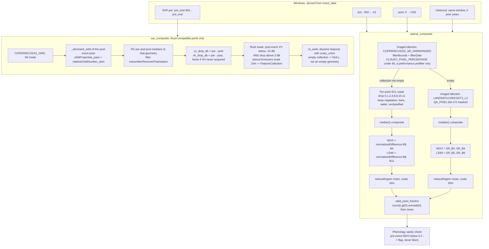

| Aspect | Value / rule | Source |
|---|---|---|
| Masking order | Mask per pixel **before** compositing, so cloudy pixels never enter the median | [gee_client.py:160](../src/evidence_intelligence/ingestion/gee_client.py#L160) |
| Why `unmask(0)` matters | GEE reducers skip masked pixels; without it, coverage would always read 1.0 exactly when coverage was worst | [gee_client.py:147](../src/evidence_intelligence/ingestion/gee_client.py#L147) |
| SWIR band choice | S2 **B11** (~1565–1655 nm), not B12 — B11 matches the MODIS band LSWI is defined on; reduction pinned to 10 m so B11 is resampled up rather than degrading NIR | [gee_client.py:20](../src/evidence_intelligence/ingestion/gee_client.py#L20) |
| Orbit pinning | Backscatter varies with incidence angle and look direction; differencing ascending against descending manufactures exactly the >3 dB drop read as flooding | [gee_client.py:254](../src/evidence_intelligence/ingestion/gee_client.py#L254) |
| VH is never substituted by VV | Cross-pol tracks canopy volume scattering, co-pol tracks surface — a missing VH leaves the signal absent | [gee_client.py:217](../src/evidence_intelligence/ingestion/gee_client.py#L217) |
| Blocking calls | `.getInfo()` per collection-size check and per reduction — each is a synchronous round trip inside the background task | throughout `gee_client.py` |

## 6. Weather ingestion internals

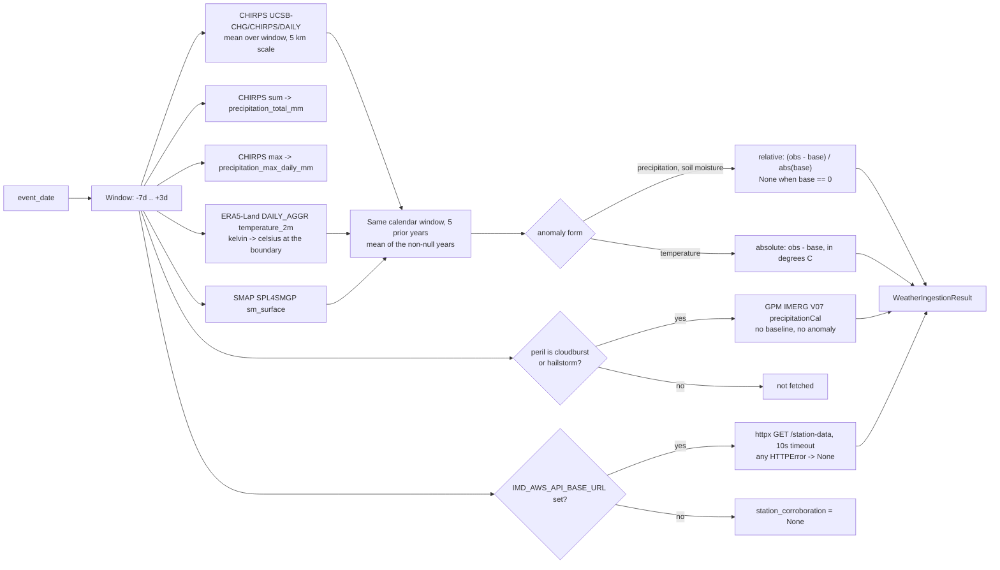

| Aspect | As built |
|---|---|
| Why total and max exist alongside the mean | 200 mm in one day inside a 10-day window averages to 20 mm/day — indistinguishable from steady rain, and cloudburst/hailstorm are the module's highest-value cases ([weather.py:117](../src/evidence_intelligence/ingestion/weather.py#L117)) |
| Unit conversion boundary | ERA5-Land serves kelvin; converting at the client keeps every `*_temp_c` consumer honest. Returning kelvin previously pushed every reading past `temp_max_c`, zeroing Component 1's biomass at full confidence ([weather.py:134](../src/evidence_intelligence/ingestion/weather.py#L134)) |
| Baseline cost | Each of the three baselined sources issues 5 extra GEE reductions per request (~18 reductions total for weather alone) |
| IMD posture | Corroborates, never substitutes; absence is recorded, not filled ([weather.py:152](../src/evidence_intelligence/ingestion/weather.py#L152)) |
| Optional client methods | `_optional` tolerates a client without the extreme-rainfall statistics rather than failing the request ([weather.py:314](../src/evidence_intelligence/ingestion/weather.py#L314)) |

## 7. The observation layer — the module's central discipline

`observe()` is the single place that decides *what was actually measured for this field*. Everything
downstream reads `FieldObservations` and never a raw bundle. This is what prevents the recurring
defect class where an unmeasured input becomes a number.

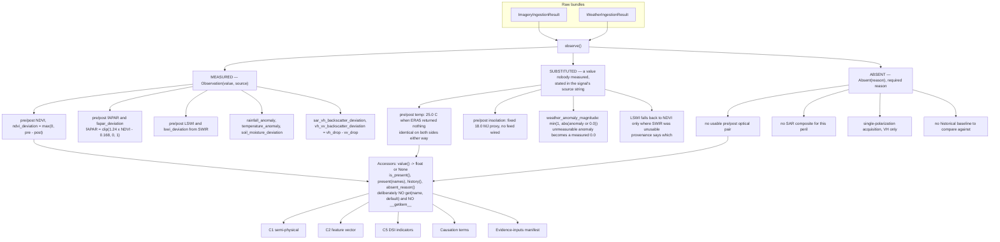

| Aspect | As built |
|---|---|
| Enforcement mechanism | The API shape, not a type checker — no default-returning accessor exists, so a fallback must be written visibly at the call site ([observation.py:79](../src/evidence_intelligence/observation.py#L79)) |
| Why the reason is mandatory | "Missing" and "missing because no post-event composite cleared the cloud gate" are different claims in an evidence package; only the second is auditable |
| Empty history == no history | Both return `None`; treating "no archive" as "zero variance" is what collapses the DSI's entropy weights ([observation.py:118](../src/evidence_intelligence/observation.py#L118)) |
| Known preserved substitutions | The 25 °C temperature and the 0.0 weather anomaly are deliberately *not* corrected here — they were lifted verbatim so the golden fixtures stay byte-identical, and are flagged for tasks that own the fixture flip ([observation.py:292](../src/evidence_intelligence/observation.py#L292), [:343](../src/evidence_intelligence/observation.py#L343)) |
| Known quantity mismatch | The NDVI *history* holds absolute index values while `NDVI_DEVIATION` is a drop — pinned, not fixed ([observation.py:381](../src/evidence_intelligence/observation.py#L381)) |

## 8. Damage model layer and ensemble weighting

Five components, three gates, one confidence-weighted blend.

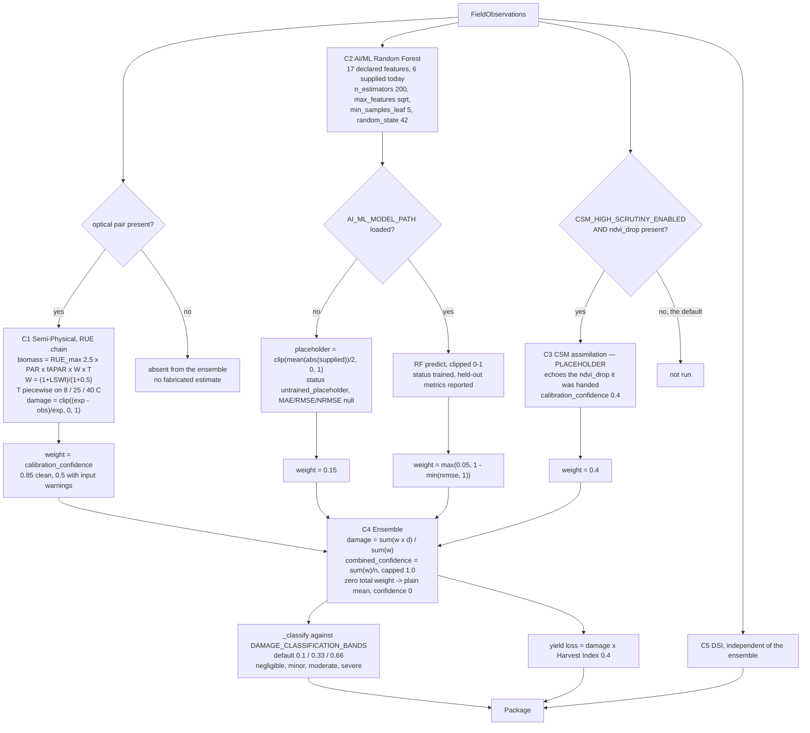

| Aspect | As built |
|---|---|
| C1 algebra today | Insolation is the same constant on both sides and temperature is passed identically, so RUE, PAR and the temperature scalar cancel: the damage fraction reduces to `1 − (fAPAR_post × (1+LSWI_post)) / (fAPAR_pre × (1+LSWI_pre))`, clipped. It still contributes weight 0.85 to the blend ([semi_physical.py:75](../src/evidence_intelligence/models/semi_physical.py#L75)) |
| C1 unit sanity check | A temperature outside [−90, 60] means the caller supplied non-celsius; confidence drops to 0.5 and a warning reaches the package ([semi_physical.py:23](../src/evidence_intelligence/models/semi_physical.py#L23)) |
| C2 feature reality | Supplied: `ndvi_deviation`, `fapar_deviation`, `rainfall_anomaly`, `temperature_anomaly`, `soil_moisture_deviation`, `vh_vv_backscatter_deviation`. The other 11 of 17 are never computed and are omitted from the placeholder's mean; a **trained** model still receives `0.0` for them in the ordered array ([ai_ml.py:146](../src/evidence_intelligence/models/ai_ml.py#L146)) |
| C2 load safety | `load()` refuses artifacts trained under a different feature order or methodology version ([ai_ml.py:122](../src/evidence_intelligence/models/ai_ml.py#L122)) |
| C3 status | A placeholder that restates another component's input into a confidence-weighted average — i.e. it manufactures corroboration. Keep the flag off ([csm_assimilation.py:1](../src/evidence_intelligence/models/csm_assimilation.py#L1)) |
| Harvest Index | One `0.4` for every crop, read from `CropParameters` so C1 and C2 cannot drift apart; the request contract carries no crop type to look a real value up by, and every package discloses this ([pipeline.py:161](../src/evidence_intelligence/pipeline.py#L161)) |
| Classification bands | Configuration, not a sourced standard; disclosed in every package ([pipeline.py:673](../src/evidence_intelligence/pipeline.py#L673)) |

## 9. Causation scoring — exclusion, not zero-filling

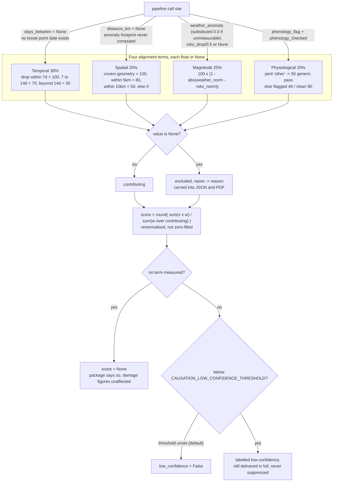

| Aspect | As built |
|---|---|
| Effective score today, Tier A/B | Temporal and spatial are always `None` at the call site, so the score is the renormalised blend of magnitude and physiological only — weights 0.25 and 0.20 become 55.6% and 44.4% ([pipeline.py:453](../src/evidence_intelligence/pipeline.py#L453)) |
| Effective score today, Tier C | All four terms absent → `score = None`, except `peril_type = other`, where the physiological generic pass returns 50 before the never-checked branch is reached ([scoring.py:123](../src/evidence_intelligence/causation/scoring.py#L123)) |
| Why exclusion beats zero | Scoring an unmeasured NDVI drop as `0.0` made the magnitude term report *perfect* correlation whenever the weather anomaly was also near zero — how a request with no imagery once outscored one with a full optical pair ([scoring.py:1](../src/evidence_intelligence/causation/scoring.py#L1)) |
| Why renormalise | Letting an excluded term keep its share of the 100 points is the same error as scoring it zero, one step removed |
| Persistence | Nullable column — a request with nothing measurable stores no score rather than a fabricated one ([schema.py:159](../src/evidence_intelligence/store/schema.py#L159)) |

## 10. Damage Severity Index (Component 5)

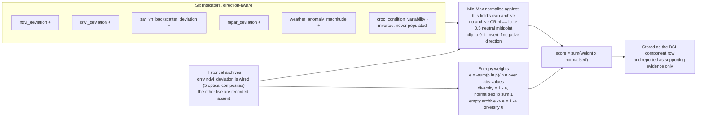

| Aspect | As built |
|---|---|
| Per-field, never per-group | Normalised against the field's own archive rather than an IU or regional average — the deliberate divergence from CHF-style indices ([dsi.py:1](../src/evidence_intelligence/models/dsi.py#L1)) |
| Weight collapse | With five of six archives empty, their diversity is 0 and effectively all weight lands on `ndvi_deviation`; with *no* archive at all the weights fall back to uniform 1/6 over six 0.5 midpoints, producing a confident-looking 0.5 from no historical evidence ([dsi.py:41](../src/evidence_intelligence/models/dsi.py#L41)) |
| Quantity mismatch | The wired archive holds absolute NDVI values while the indicator is a drop, so a real 0.45 drop normalises below the archive floor — captured in the `varied_historical_archive` golden fixture as a known-wrong value |
| Absent ≠ zero | `pipeline` passes only measured indicators; `compute` treats an absent one as the 0.5 neutral midpoint rather than a measured 0.0 ([pipeline.py:427](../src/evidence_intelligence/pipeline.py#L427)) |

## 11. Package assembly and the §65B fields

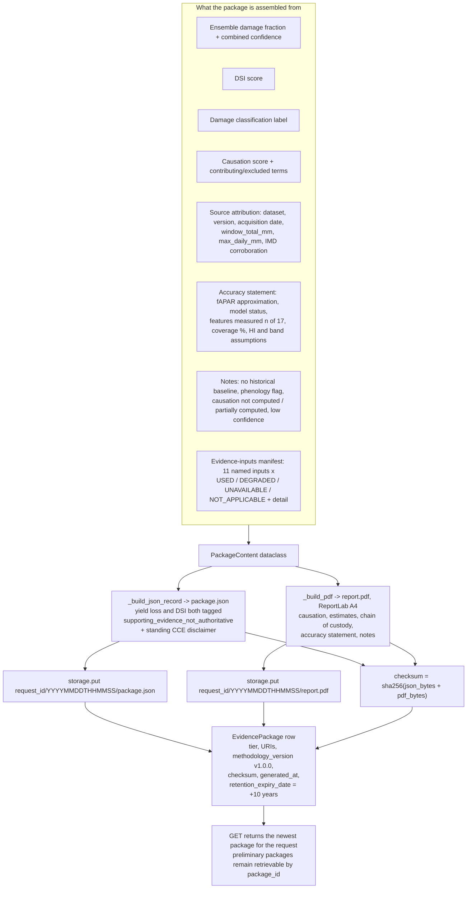

| Aspect | As built |
|---|---|
| `map_uris` | Always `[]` — the GIS map exports promised by [`hld.md` §6](hld.md) are not implemented, though `folium`/`matplotlib` are already dependencies ([report_generator.py:186](../src/evidence_intelligence/packaging/report_generator.py#L186)) |
| `affected_area_ha` | Always `None` on both the ENSEMBLE row and the package, so [`evidence-flow-spec.md` §4 step 5](evidence-flow-spec.md)'s damaged-pixel area computation has no implementation |
| Manifest coverage | Built and attached on the COMPLETE path only; the weather-only path assembles its package through a second, duplicated code path that never passes a manifest — recorded as known-wrong in two golden fixtures ([pipeline.py:634](../src/evidence_intelligence/pipeline.py#L634)) |
| Retention | Enforced at package-creation time, with a Feb-29 leap-year guard ([evidence_store.py:29](../src/evidence_intelligence/store/evidence_store.py#L29)) |
| Every tier gets the full §65B field set | Source attribution, methodology version, accuracy statement, checksum and timestamp are present on preliminary packages too |

## 12. Persistence model

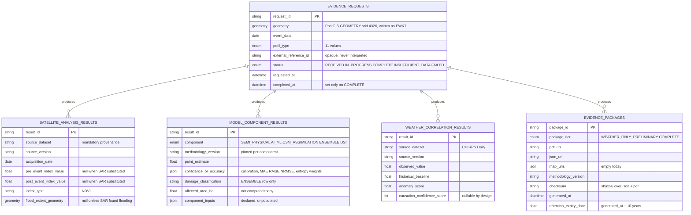

Append-only in practice: one row per component per run, multiple packages per request, and a
preliminary package is superseded by insertion rather than mutation.

## 13. Configuration gates and what each one changes in the graph

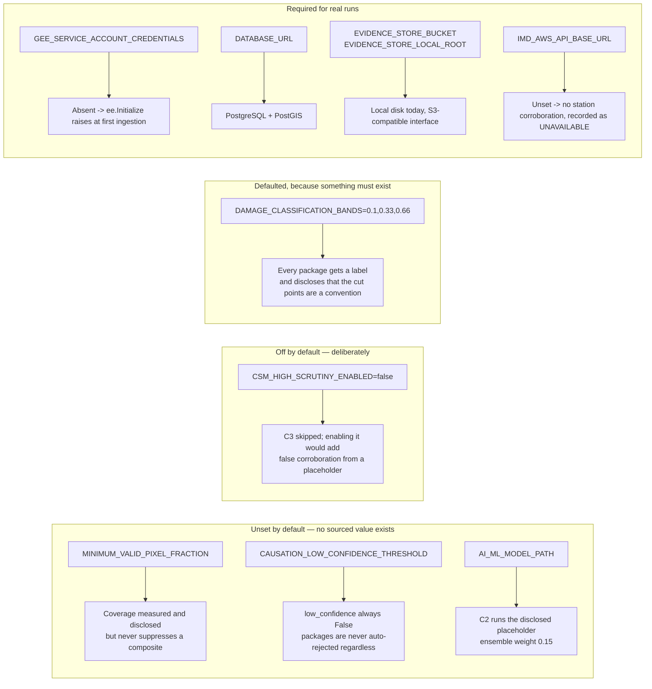

The pattern is consistent and worth naming: **a threshold with no sourced value ships unset and
disclosed rather than guessed**, and the only exception is the classification bands, because
`damage_classification` is populated on every ENSEMBLE row so *some* mapping must exist — which is
why that one carries a disclosure string instead ([config.py:22](../src/evidence_intelligence/config.py#L22)).

## 14. Test seams and the reproducibility harness

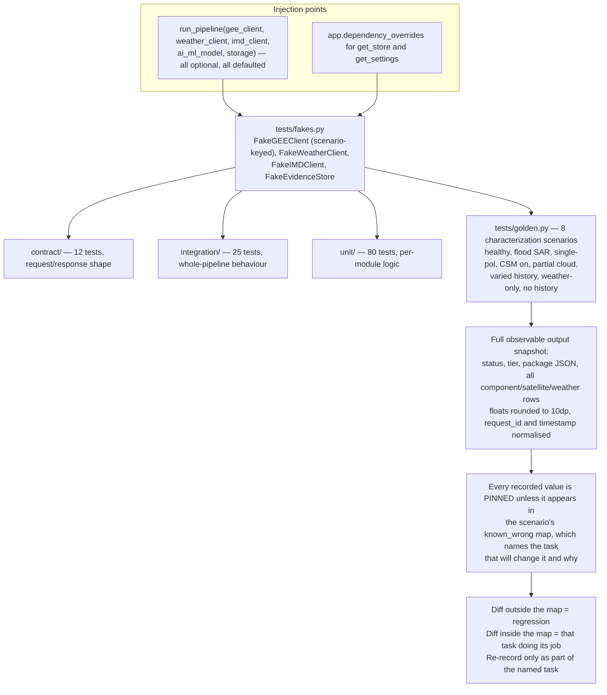

The golden harness is a change detector, not a correctness oracle: it deliberately pins values that
are known to be wrong, so that fixing one is a visible, attributable diff rather than a silent shift
([golden.py:1](../src/tests/golden.py#L1)). Determinism comes from `random_state=42`, fixed feature
ordering, pinned methodology versions per component, and fakes with no clock or network dependency.

## 15. Where the executed flow is thinner than the design

Read as a map from a diagram node to the tracker that owns it — not as new findings. Full status for
each lives in [`GUIDE.md`](../GUIDE.md) "Open Issues" and the two `issue/README.md` trackers.

| Diagram | Node | Gap | Owner |
|---|---|---|---|
| §8 | C1 semi-physical | Insolation constant and temperature identical on both sides, so those terms cancel; RUE applied to part of a season | `002` RUE part-of-season query; `T05-09` |
| §8 | C2 AI/ML | Untrained by default; 11 of 17 declared features never computed | `001` AI/ML training-data question |
| §8 | C3 CSM | Placeholder that echoes its input; flag correctly off | `001` CSM trigger query (reframed) |
| §8 | `_classify` | Band cut points appear in no source document — disclosed, not sourced | `002` `T0-17` (disclosure shipped) |
| §8 | Harvest Index | One `0.4` for all crops; no crop-type field in the request contract | `002` `T0-18` + User Story 4 |
| §9 | Temporal / spatial terms | Structurally unmeasurable today; excluded rather than fabricated | `002` `T05-05` (break-point date) |
| §10 | DSI archives | Five of six archives unwired; quantity mismatch on the sixth | `002` `T0R-05`, `T05-10` |
| §11 | `map_uris`, `affected_area_ha` | Promised by `hld.md` §6 / `evidence-flow-spec.md` §4, not implemented | not yet tracked as a task |
| §11 | Weather-only assembly | Duplicate package-assembly path, no manifest attached | `002` `T0R-06` |
| §2 | Retry scheduling | `retry_insufficient_data` exists but nothing calls it in `src/` | `002` `T05-06` (durability) |
| §11 | No outcome capture | The module discards claim outcomes — now **by design**, not by omission: label sourcing is out of scope per `constitution.md` §9.2 | closed; see `notes/2026-08-13-scope-boundaries-design.md` |
| §7 | Preserved substitutions | 25 °C temperature, 0.0 weather anomaly | flagged in `tasks.md`, fixture-owning tasks |

None of these are in the diagrams by accident: the module's stated posture is that an undisclosed
assumption is worse than a disclosed one, so most of them are already visible in the package a
reader receives.
